# STORY-1: Enhanced Foundation Setup

**Epic**: [EPIC-001] Enterprise Foundation Architecture
**Total Effort**: 24 Story Points (~5-6 days for senior developer)
**Prerequisites**: NestJS framework and PostgreSQL configured

## 🎯 Story Objective

Establish a robust enterprise-grade foundation for the Todo Application backend, implementing a dual-layer entity architecture (BaseEntity + AnagraficaBaseEntity), advanced temporal management with division support, soft delete mechanisms, generic repository patterns with uniqueness constraints, automatic snake_case to camelCase conversion, dynamic HTTP filtering with TypeORM-inspired syntax, and ACID transaction handling that will support all future development.

## 🏗️ Story Architecture

## ✅ Story Acceptance Criteria

### **Functional Requirements**

- [ ] Dual-layer entity architecture (BaseEntity + AnagraficaBaseEntity)
- [ ] Division field with default division auto-generation
- [ ] Complete soft delete implementation (no hard deletes)
- [ ] Uniqueness constraints on (code, description, division) combinations
- [ ] Automatic snake_case to camelCase conversion
- [ ] Dynamic HTTP filtering with TypeORM-inspired payload syntax
- [ ] Generic repository pattern for consistent data access
- [ ] Enhanced transaction support for complex operations
- [ ] Automatic timezone handling for global users
- [ ] Comprehensive audit trail for all data changes

### **Technical Requirements**

- [ ] PostgreSQL `timestamptz` support with proper indexing
- [ ] Performance indices for business entity queries
- [ ] Uniqueness indices for constraint enforcement
- [ ] HTTP payload filtering with entity metadata integration
- [ ] Configurable repository-level filtering capabilities
- [ ] One-level relationship filtering with AND logic
- [ ] TypeORM integration with advanced query capabilities
- [ ] Type-safe repository methods with auto-completion
- [ ] Transaction decorators for declarative usage
- [ ] Division-aware data access control
- [ ] Performance monitoring and optimization
- [ ] Test coverage ≥ 85% across all foundation components

### **Business Requirements**

- [ ] Data preservation and recovery capabilities
- [ ] Division-based data organization and isolation
- [ ] Global timezone support for international users
- [ ] Business entity uniqueness enforcement
- [ ] Audit compliance for enterprise requirements
- [ ] Scalable architecture for future growth
- [ ] High availability and data consistency

## 📋 Task Breakdown

### **TASK-1.1: Base Entity & Timezone Management** (5 hours)

**Focus**: Temporal foundation and global timezone support

- **Deliverables**:
  - Base entity with `timestamptz` columns
  - Automatic timezone detection from user/headers
  - `validity_end` column for record deprecation
  - Conversion utilities for API serialization

- **Key Features**:
  - UTC storage with timezone offset preservation
  - Automatic audit timestamps (created_at, updated_at)
  - Business day and working hours utilities
  - DST transition handling

- **Tests**: Entity validation, timezone conversion, edge cases

### **TASK-1.2: Soft Delete Implementation** (3 hours)

**Focus**: Data preservation without hard deletion

- **Deliverables**:
  - `active` boolean column in base entity
  - Repository scopes for active/deleted filtering
  - Restoration methods with audit trail
  - Business rule enforcement

- **Key Features**:
  - No hard delete implementation anywhere
  - Admin-only access to deleted records
  - Cascade soft delete for related entities
  - Performance optimization with partial indices

- **Tests**: Soft delete behavior, query scopes, restoration

### **TASK-1.3: Generic Repository Helper** (4 hours)

**Focus**: Type-safe, reusable data access patterns

- **Deliverables**:
  - Generic repository with CRUD operations
  - Advanced pagination (offset and cursor)
  - Type-safe query building
  - Filter and sort capabilities

- **Key Features**:
  - Preserved TypeScript auto-completion
  - Relationship loading optimization
  - Performance monitoring
  - Consistent API patterns

- **Tests**: CRUD operations, pagination, type safety

### **TASK-1.4: Transaction Management** (3 hours)

**Focus**: ACID compliance and reliability

- **Deliverables**:
  - Transaction manager with decorators
  - Deadlock detection and retry
  - Savepoint support for nested transactions
  - Performance monitoring

- **Key Features**:
  - Automatic commit/rollback
  - Connection pooling integration
  - Transaction timeout handling
  - Comprehensive error handling

- **Tests**: Transaction flows, deadlock scenarios, monitoring

### **TASK-1.5: HTTP Filtering Helper** (5 hours)

**Focus**: Dynamic API filtering with TypeORM-inspired syntax

- **Deliverables**:
  - FilterPayloadDto with validation
  - FilterableRepository interface
  - Entity metadata extraction
  - Controller integration patterns

- **Key Features**:
  - TypeORM-inspired filter syntax
  - One-level relationship filtering
  - Configurable repository filters
  - Performance-optimized queries

- **Tests**: Filter validation, query optimization, relationship filtering

## 🎯 Value Proposition

### **Business Value**

- **Data Integrity**: Enterprise-grade data consistency and reliability
- **Global Reach**: Timezone support for international expansion
- **Compliance**: Comprehensive audit trails for regulatory requirements
- **API Flexibility**: Dynamic filtering reduces custom endpoint development
- **Division Management**: Multi-organizational data isolation and control
- **Recovery**: Soft delete enables data recovery and business continuity

### **Technical Value**

- **Developer Productivity**: Consistent patterns reduce development time
- **Performance**: Optimized queries and connection pooling
- **Maintainability**: Type-safe, well-tested foundation components
- **Scalability**: Architecture supports high-load scenarios

### **Long-term Value**

- **Future-proof**: Foundation supports advanced features
- **Quality**: High test coverage ensures reliability
- **Documentation**: Comprehensive guides for team onboarding
- **Monitoring**: Built-in observability for production operations

## 🔄 TDD Workflow per Task

### **Red-Green-Refactor Cycle**

```mermaid
graph LR
    RED[🔴 Write Failing Tests]
    GREEN[🟢 Minimal Implementation]
    REFACTOR[🔧 Improve Quality]

    RED --> GREEN
    GREEN --> REFACTOR
    REFACTOR --> RED
```

### **Foundation-Specific TDD Patterns**

- **Entity Testing**: Lifecycle hooks, validation, relationships
- **Repository Testing**: CRUD operations, query optimization
- **Transaction Testing**: ACID properties, error scenarios
- **Integration Testing**: End-to-end workflows, performance

## 🚀 Definition of Done (Story Level)

### **Functional Completion**

- ✅ All task acceptance criteria met
- ✅ Foundation components integrated seamlessly
- ✅ Timezone management working globally
- ✅ Soft delete enforced throughout application

### **Quality Gates**

- ✅ Test coverage ≥ 85% across all components
- ✅ Performance benchmarks met for all operations
- ✅ Code review completed with senior developer
- ✅ Security validation passed

### **Documentation**

- ✅ API documentation for all foundation components
- ✅ Developer guides for using foundation patterns
- ✅ Architecture decision records (ADRs) documented
- ✅ Troubleshooting guides available

### **Integration**

- ✅ All components work together seamlessly
- ✅ Database schema optimized and indexed
- ✅ CI/CD pipeline passing all tests
- ✅ Production deployment checklist complete

## 🔗 Dependencies & Blockers

### **Prerequisites (Required)**

- ✅ NestJS framework setup
- ✅ PostgreSQL database configured
- ✅ TypeORM integration complete
- ✅ Testing framework established

### **Dependencies for Future Stories**

- **Story 2**: User management will build on foundation
- **Story 3**: Task management will use all foundation components
- **Story 4**: Production deployment relies on foundation stability

## 📊 Success Metrics

### **Technical Metrics**

- **Test Coverage**: Target ≥ 85%
- **Performance**: Database operations <100ms
- **Reliability**: Zero data corruption incidents
- **Code Quality**: SonarJS quality gate passed

### **Business Metrics**

- **Developer Velocity**: 40% faster entity development
- **Data Recovery**: 100% soft delete preservation
- **Global Support**: Timezone handling for all regions
- **Audit Compliance**: Complete data change tracking

## 🧪 Test Strategy Summary

### **Test Distribution**

- **Unit Tests**: ~65% (individual component testing)
- **Integration Tests**: ~25% (component interaction testing)
- **E2E Tests**: ~10% (complete workflow validation)

### **Critical Test Scenarios**

- Timezone conversion accuracy across DST transitions
- Soft delete cascade behavior with complex relationships
- Transaction rollback under various error conditions
- Performance under high concurrent load

## 📈 Implementation Timeline

### **Day 1: Temporal Foundation**

- TASK-1.1: Base Entity & Timezone Management
- Database schema with timestamptz
- Timezone detection and conversion utilities

### **Day 2: Data Safety & Access**

- TASK-1.2: Soft Delete Implementation
- TASK-1.3: Generic Repository Helper
- Data preservation and access patterns

### **Day 3: Reliability & Polish**

- TASK-1.4: Transaction Management
- Integration testing and optimization
- Documentation and deployment preparation

## 🔧 Risk Mitigation

### **Technical Risks**

- **Timezone Complexity**: Comprehensive test suite for edge cases
- **Performance Impact**: Continuous monitoring and optimization
- **Transaction Deadlocks**: Robust retry mechanisms

### **Business Risks**

- **Data Loss**: Multiple safety layers with soft delete
- **Compliance**: Audit trail covers all data changes
- **Scalability**: Architecture designed for growth

## 📝 Implementation Notes

### **Critical Success Factors**

1. **Test-First Development**: All components must have comprehensive tests
2. **Performance Focus**: Monitor and optimize database operations
3. **Type Safety**: Preserve TypeScript benefits throughout stack
4. **Documentation**: Clear guides for future developers

### **Architectural Decisions**

- PostgreSQL for robust ACID properties and timezone support
- TypeORM for type-safe database interactions
- Soft delete for business continuity and compliance
- Generic patterns for developer productivity

---

**🎯 Foundation ready to support enterprise-grade Todo Application development**
