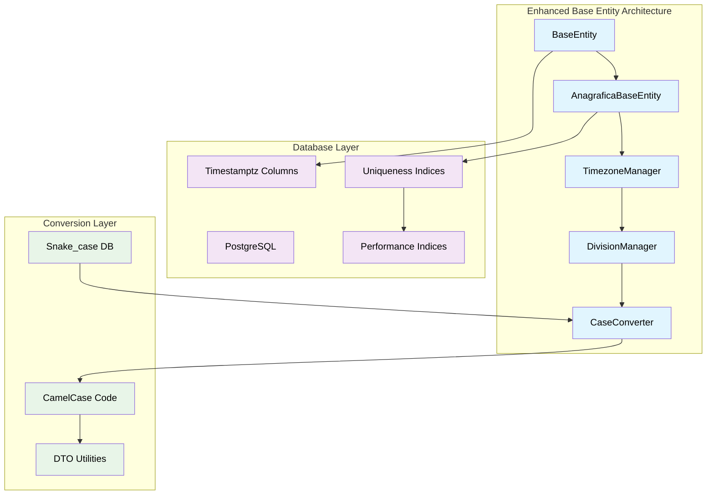
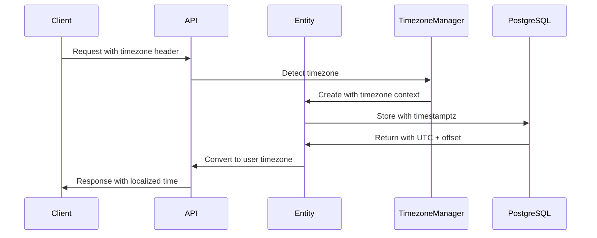
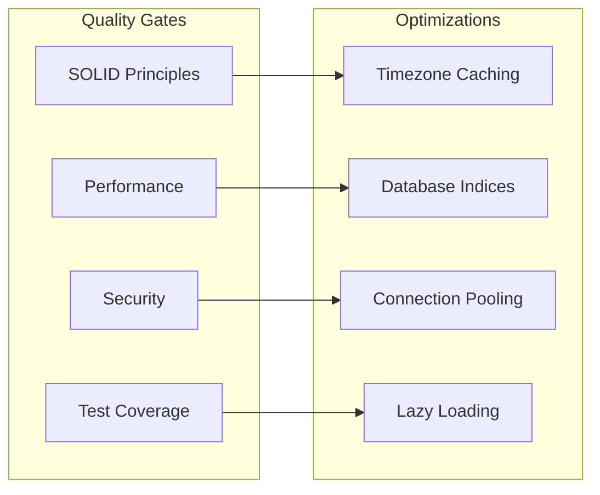

# TASK-1.1: Enhanced Base Entity Architecture

**Epic**: [EPIC-001] Foundation Setup
**Story**: [STORY-001] Foundation Architecture
**Effort**: 6 Story Points (~6 hours)
**Prerequisites**: TypeORM and PostgreSQL configured

## 🎯 Task Objective

Create a comprehensive dual-layer base entity architecture with BaseEntity for common functionality and AnagraficaBaseEntity for business entities, implementing advanced timezone management, division support, uniqueness constraints, and automatic snake_case to camelCase conversion utilities.

## ✅ Acceptance Criteria

### **Core Requirements**

- [ ] BaseEntity with PostgreSQL `timestamptz` support and division field
- [ ] AnagraficaBaseEntity extending BaseEntity with code, description, division
- [ ] Automatic timezone detection from user profile/request headers
- [ ] `validity_end` column for record deprecation tracking
- [ ] Default division generation for customers without division
- [ ] Uniqueness constraints on (code, description, division) combinations

### **Technical Requirements**

- [ ] TypeORM entity decorators with proper constraints and indices
- [ ] Database indices for temporal queries and performance optimization
- [ ] Uniqueness indices for business entity constraints
- [ ] Snake_case to camelCase conversion utilities
- [ ] Timezone-aware DTO validation and transformation
- [ ] Comprehensive error handling for timezone and division edge cases
- [ ] Test coverage ≥ 90% (critical foundation component)

### **Business Requirements**

- [ ] Support for global user base across timezones
- [ ] Division-based data organization and access control
- [ ] Accurate temporal tracking for audit purposes
- [ ] Record deprecation without data loss
- [ ] Consistent time representation in APIs
- [ ] Business entity uniqueness enforcement

## 🏗️ Implementation Architecture



## 🧪 TDD Red-Green-Refactor Approach

### **🔴 Red Phase: Failing Tests**

```typescript
// Test structure (pseudo-code)
describe('BaseEntity Timezone Management', () => {
  describe('Entity Creation', () => {
    it('should create entity with UTC timestamps');
    it('should store timezone offset with each record');
    it('should validate timestamptz format');
  });

  describe('Timezone Detection', () => {
    it('should detect timezone from user profile');
    it('should fallback to request headers');
    it('should handle invalid timezone gracefully');
  });

  describe('Validity End Column', () => {
    it('should track record deprecation');
    it('should query active records by default');
    it('should support temporal queries');
  });
});
```

### **🟢 Green Phase: Implementation Strategy**



### **🔧 Refactor Phase: Quality Improvements**



## 📋 Detailed Implementation Steps

### **Step 1: Enhanced Base Entity Structure**

**Pseudo-code Pattern:**

```typescript
// BaseEntity - Foundation for all entities
abstract class BaseEntity {
  id: UUID (primary key)
  created_at: timestamptz (auto-generated)
  updated_at: timestamptz (auto-updated)
  validity_end: timestamptz (nullable, for deprecation)
  timezone_offset: string (user's timezone at creation)
  division_id: UUID (references Division, with default)
  version: number (optimistic locking)

  beforeInsert(): auto-set timestamps and default division
  beforeUpdate(): auto-update updated_at
  deprecate(reason?: string): set validity_end
  isActive(): boolean (validity_end is null)
}

// AnagraficaBaseEntity - For business entities (users, customers, etc.)
abstract class AnagraficaBaseEntity extends BaseEntity {
  code: string (business code, part of uniqueness)
  description: string (display name, part of uniqueness)

  // Uniqueness constraint: (code, description, division_id)
  validateUniqueness(): Promise<boolean>
  generateCode(): string (auto-generation if needed)
}
```

**Database Schema:**

```sql
-- Enhanced schema with division and uniqueness constraints
CREATE TABLE base_entity (
  id UUID PRIMARY KEY DEFAULT gen_random_uuid(),
  created_at TIMESTAMPTZ NOT NULL DEFAULT NOW(),
  updated_at TIMESTAMPTZ NOT NULL DEFAULT NOW(),
  validity_end TIMESTAMPTZ NULL,
  timezone_offset VARCHAR(50) NOT NULL,
  division_id UUID NOT NULL REFERENCES division(id),
  version INTEGER NOT NULL DEFAULT 1
);

-- AnagraficaBaseEntity additional columns
CREATE TABLE anagrafica_base_entity (
  id UUID PRIMARY KEY REFERENCES base_entity(id),
  code VARCHAR(50) NOT NULL,
  description VARCHAR(255) NOT NULL,

  -- Uniqueness constraint
  CONSTRAINT uk_anagrafica_code_desc_div
    UNIQUE (code, description, division_id)
);

-- Performance indices
CREATE INDEX idx_base_entity_active ON base_entity (validity_end) WHERE validity_end IS NULL;
CREATE INDEX idx_base_entity_division ON base_entity (division_id);
CREATE INDEX idx_base_entity_created_at ON base_entity (created_at);
CREATE INDEX idx_anagrafica_code ON anagrafica_base_entity (code);
CREATE INDEX idx_anagrafica_description ON anagrafica_base_entity (description);
```

### **Step 2: Division Management System**

**Architecture Pattern:**

```typescript
// Division entity for organizational structure
class Division extends BaseEntity {
  name: string;
  code: string;
  is_default: boolean;
  parent_division_id?: UUID;

  static getDefault(): Promise<Division>;
  static createDefault(name: string): Promise<Division>;
}

// Division Manager for automatic assignment
class DivisionManager {
  async getOrCreateDefault(): Promise<Division>;
  async assignDivision(userId: string): Promise<Division>;
  async validateDivisionAccess(
    userId: string,
    divisionId: string,
  ): Promise<boolean>;
}
```

### **Step 3: Snake_case to CamelCase Conversion System**

**Conversion Utilities:**

```typescript
// Automatic case conversion for database/code mapping
class CaseConverter {
  // Convert database snake_case to TypeScript camelCase
  static toCamelCase(obj: Record<string, any>): Record<string, any>;

  // Convert TypeScript camelCase to database snake_case
  static toSnakeCase(obj: Record<string, any>): Record<string, any>;

  // Property name conversion
  static propertyToCamelCase(property: string): string;
  static propertyToSnakeCase(property: string): string;
}

// TypeORM transformer for automatic conversion
class CaseTransformer implements ValueTransformer {
  to(value: any): any; // camelCase to snake_case
  from(value: any): any; // snake_case to camelCase
}
```

### **Step 4: Enhanced Timezone Management**

**Integration with Division and Conversion:**

```typescript
class TimezoneManager {
  async detectFromUser(userId: string): Promise<string>;
  async detectFromHeaders(request: Request): string;
  async getTimezoneByDivision(divisionId: string): Promise<string>;
  validateTimezone(tz: string): boolean;
  getDefaultTimezone(): string;
}

class TimezoneConverter {
  toUTC(date: Date, timezone: string): Date;
  fromUTC(date: Date, timezone: string): Date;
  formatForAPI(date: Date, timezone: string): string;
  parseFromAPI(dateString: string): Date;
}
```

### **Step 3: DTO Integration**

**Validation Pattern:**

```
BaseEntityDto {
  @ApiProperty()
  @IsDateString()
  created_at: string

  @ApiProperty()
  @IsOptional()
  @IsDateString()
  validity_end?: string

  @ApiProperty()
  @IsTimezone()
  timezone: string
}
```

### **Step 4: Utility Functions**

**Helper Utilities:**

```
TimezoneUtils {
  + isBusinessDay(date, timezone): boolean
  + getBusinessHours(timezone): {start, end}
  + addBusinessDays(date, days, timezone): Date
  + handleDST(date, timezone): Date
  + calculateOffset(timezone): number
}
```

## 🧪 Test Strategy

### **Unit Tests (70%)**

- Entity lifecycle hooks
- Timezone detection logic
- Conversion utilities
- Validation functions
- Edge case handling

### **Integration Tests (25%)**

- Database timestamp storage
- Entity-service integration
- Timezone conversion flows
- Query performance with indices

### **E2E Tests (5%)**

- Complete API request/response cycle
- Multi-timezone user scenarios
- Temporal query validation

## ✅ Definition of Done

### **Functional Completion**

- ✅ Base entity created with all required columns
- ✅ Timezone detection working automatically
- ✅ UTC storage with offset preservation implemented
- ✅ Validity end column tracking functional
- ✅ Conversion utilities working correctly

### **Quality Gates**

- ✅ Test coverage ≥ 90%
- ✅ All timezone edge cases handled
- ✅ Database performance optimized
- ✅ Code review passed
- ✅ Documentation complete

### **Technical Validation**

- ✅ TypeORM decorators properly configured
- ✅ PostgreSQL timestamptz working
- ✅ API serialization consistent
- ✅ Error handling comprehensive
- ✅ Performance benchmarks met

## 🔧 Troubleshooting Guide

### **Common Issues & Solutions**

**Issue**: Timezone conversion errors
**Solution**: Validate timezone strings, implement fallback mechanisms

**Issue**: Database timestamp inconsistencies
**Solution**: Use timestamptz exclusively, verify connection timezone settings

**Issue**: DST transition problems
**Solution**: Use moment-timezone or date-fns-tz for reliable DST handling

**Issue**: Performance with temporal queries
**Solution**: Implement partial indices on validity_end column

## 📊 Success Metrics

### **Performance Targets**

- Timezone detection: <50ms
- Conversion operations: <10ms
- Database queries with temporal filters: <100ms
- Memory usage for timezone cache: <10MB

### **Quality Targets**

- Zero timezone-related bugs in production
- 100% coverage for critical timezone paths
- Sub-second response times for temporal queries
- Zero data loss during timezone transitions

## 🔗 Dependencies & Integration

### **Requires (Input Dependencies)**

- PostgreSQL database configured
- TypeORM entity framework setup
- Configuration management system
- Environment variable validation

### **Provides (Output Dependencies)**

- BaseEntity foundation for all entities
- AnagraficaBaseEntity for business entities
- Division management system
- Snake_case to camelCase conversion utilities
- Timezone utilities for application
- Uniqueness constraint enforcement
- Performance optimization indices
- Temporal query foundation
- Audit trail capabilities

### **Enables Next Tasks**

- **TASK-1.2**: Division-aware Soft Delete Implementation
- **TASK-1.3**: Enhanced Generic Repository Helper
- **TASK-1.4**: Enhanced Transaction Management

## 📝 Implementation Notes

### **Security Considerations**

- Validate all timezone inputs to prevent injection
- Sanitize timezone offset data
- Implement rate limiting for timezone detection
- Log timezone-related security events

### **Performance Optimizations**

- Cache frequently used timezone conversions
- Use connection pooling for database operations
- Implement lazy loading for timezone data
- Optimize database indices for temporal queries

### **Scalability Preparations**

- Design for horizontal scaling
- Consider timezone data partitioning
- Plan for distributed timezone caching
- Prepare for microservices timezone coordination

---

**🎯 Ready to implement enterprise-grade temporal foundation with TDD methodology**
