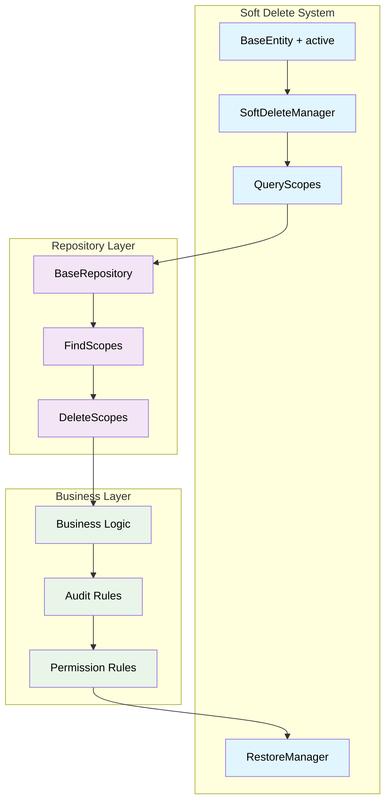
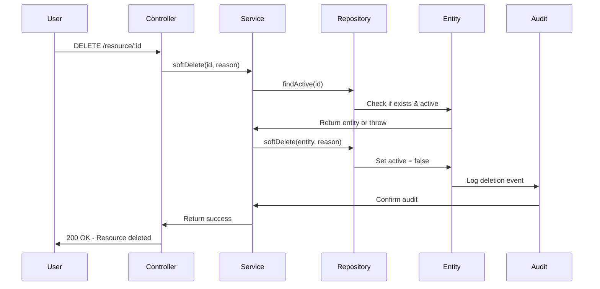
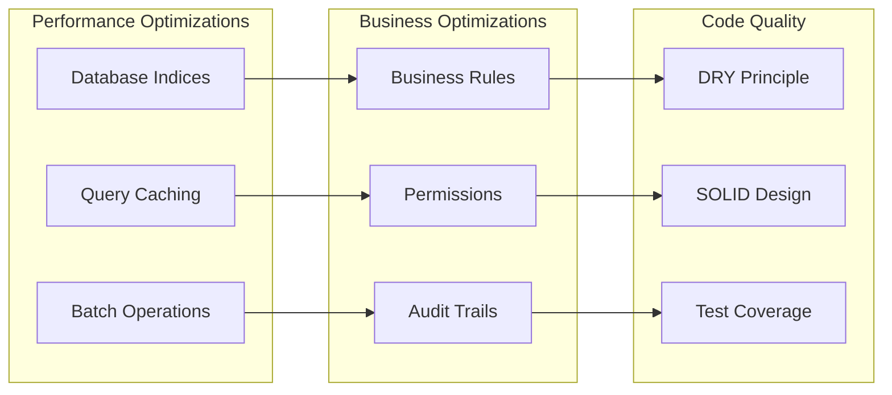

# TASK-1.2: Division-aware Soft Delete Implementation

**Epic**: [EPIC-001] Foundation Setup
**Story**: [STORY-001] Foundation Architecture
**Effort**: 4 Story Points (~4 hours)
**Prerequisites**: Enhanced Base Entity with division support (TASK-1.1)

## 🎯 Task Objective

Implement enterprise-grade soft delete functionality that works seamlessly with the enhanced BaseEntity and AnagraficaBaseEntity architecture, providing division-aware data management, audit trails, and proper business logic enforcement throughout the application lifecycle.

## ✅ Acceptance Criteria

### **Core Requirements**

- [ ] `active` boolean column in BaseEntity (default: true)
- [ ] Division-aware soft delete operations
- [ ] No hard delete implementation anywhere in codebase
- [ ] Soft delete method with comprehensive audit trail
- [ ] Query scopes to filter active/inactive records by division
- [ ] Business logic enforcement for soft delete rules
- [ ] Restoration capability with division validation
- [ ] Integration with AnagraficaBaseEntity uniqueness constraints

### **Technical Requirements**

- [ ] TypeORM global query scopes for active records
- [ ] Division-based access control for delete operations
- [ ] Repository methods respect soft delete and division boundaries
- [ ] Admin-only access for viewing deleted records across divisions
- [ ] Database constraints prevent orphaned records
- [ ] Snake_case to camelCase conversion integration
- [ ] Test coverage ≥ 85% for delete operations

### **Business Requirements**

- [ ] Data compliance with audit requirements
- [ ] Recovery mechanisms for business continuity
- [ ] Division-isolated data management
- [ ] Clear distinction between archived and deleted
- [ ] Performance optimization for active record queries
- [ ] Uniqueness constraint preservation during soft delete

## 🏗️ Soft Delete Architecture



## 🧪 TDD Red-Green-Refactor Approach

### **🔴 Red Phase: Failing Tests**

```typescript
// Test structure (pseudo-code)
describe('Soft Delete Implementation', () => {
  describe('Entity Soft Delete', () => {
    it('should mark record as inactive instead of removing');
    it('should preserve all data when soft deleted');
    it('should update audit fields on deletion');
    it('should prevent hard delete operations');
  });

  describe('Query Scopes', () => {
    it('should return only active records by default');
    it('should allow querying inactive records explicitly');
    it('should handle complex queries with soft delete');
  });

  describe('Business Logic', () => {
    it('should enforce deletion rules');
    it('should log deletion reasons');
    it('should handle cascade soft delete');
  });

  describe('Restoration', () => {
    it('should restore soft deleted records');
    it('should validate restoration permissions');
    it('should audit restoration operations');
  });
});
```

### **🟢 Green Phase: Implementation Flow**



### **🔧 Refactor Phase: Optimization**



## 📋 Detailed Implementation Steps

### **Step 1: Base Entity Enhancement**

**Pseudo-code Pattern:**

```
BaseEntity {
  // ... existing fields from TASK-1.1
  + active: boolean (default: true)
  + deleted_at: timestamptz (nullable)
  + deleted_by: UUID (nullable, user who deleted)
  + deletion_reason: string (nullable)

  + softDelete(userId, reason): void
  + restore(userId, reason): void
  + isActive(): boolean
  + isDeleted(): boolean
}
```

**Database Migration:**

```sql
-- Add soft delete columns to base entity
ALTER TABLE base_entity
ADD COLUMN active BOOLEAN NOT NULL DEFAULT true,
ADD COLUMN deleted_at TIMESTAMPTZ NULL,
ADD COLUMN deleted_by UUID NULL,
ADD COLUMN deletion_reason TEXT NULL;

-- Performance index for active records
CREATE INDEX idx_active_records ON base_entity (active) WHERE active = true;
CREATE INDEX idx_deleted_records ON base_entity (deleted_at) WHERE active = false;
```

### **Step 2: Repository Scopes**

**Query Scope Pattern:**

```
BaseRepository<T extends BaseEntity> {
  + findAllActive(options?): Promise<T[]>
  + findOneActive(id): Promise<T>
  + findWithDeleted(options?): Promise<T[]>
  + findOnlyDeleted(options?): Promise<T[]>

  + softDelete(id, userId, reason): Promise<void>
  + restore(id, userId, reason): Promise<void>
  + hardDelete(id): never // Throws error
}
```

### **Step 3: Service Layer Business Logic**

**Business Rules Pattern:**

```
SoftDeleteService {
  + canDelete(entityId, userId): Promise<boolean>
  + validateDeletion(entity): Promise<ValidationResult>
  + performSoftDelete(entity, context): Promise<void>
  + cascadeDelete(parentEntity): Promise<void>
  + auditDeletion(entity, user, reason): Promise<void>
}
```

### **Step 4: Global Query Scopes**

**TypeORM Global Scope:**

```
@Entity()
@Scope('active', { active: true })
export abstract class BaseEntity {
  // Implementation with automatic filtering
}

QueryBuilder {
  + withDeleted(): QueryBuilder // Include deleted
  + onlyDeleted(): QueryBuilder // Only deleted
  + activeOnly(): QueryBuilder // Default behavior
}
```

## 🧪 Test Strategy

### **Unit Tests (60%)**

- Soft delete method behavior
- Query scope functionality
- Business rule validation
- Restoration logic
- Permission checks

### **Integration Tests (30%)**

- Repository-service integration
- Database constraint enforcement
- Cascade delete operations
- Query performance with scopes

### **E2E Tests (10%)**

- Complete deletion workflows
- Admin restore operations
- Multi-entity cascade scenarios

## ✅ Definition of Done

### **Functional Completion**

- ✅ Soft delete implemented with active column
- ✅ No hard delete methods available
- ✅ Query scopes working correctly
- ✅ Restoration functionality complete
- ✅ Audit trails for all operations

### **Quality Gates**

- ✅ Test coverage ≥ 85%
- ✅ Performance benchmarks met
- ✅ Security validation passed
- ✅ Code review completed
- ✅ Documentation updated

### **Business Validation**

- ✅ Data preservation guaranteed
- ✅ Compliance requirements met
- ✅ Recovery procedures tested
- ✅ Permission model enforced

## 🔧 Troubleshooting Guide

### **Common Issues & Solutions**

**Issue**: Performance degradation with large datasets
**Solution**: Implement partial indices on active column, use query optimization

**Issue**: Cascade delete complexity
**Solution**: Implement asynchronous cascade with proper rollback mechanisms

**Issue**: Accidental exposure of deleted data
**Solution**: Enforce repository scopes, add integration tests for data leakage

**Issue**: Restoration conflicts
**Solution**: Validate entity state before restoration, check business constraints

## 📊 Success Metrics

### **Performance Targets**

- Query performance impact: <10% overhead for active filtering
- Soft delete operation: <100ms for single entity
- Cascade delete: <5 seconds for complex hierarchies
- Restoration time: <200ms per entity

### **Quality Targets**

- Zero accidental hard deletes
- 100% audit trail completeness
- Zero data exposure of deleted records
- 95% successful restoration rate

## 🔗 Dependencies & Integration

### **Requires (Input Dependencies)**

- ✅ TASK-1.1: Base Entity with timezone management
- Database migration capabilities
- Audit logging system
- User authentication context

### **Provides (Output Dependencies)**

- Soft delete foundation for all entities
- Repository pattern with scopes
- Business rule enforcement framework
- Data preservation guarantees

### **Enables Next Tasks**

- **TASK-1.3**: Generic Repository Helper
- **TASK-1.4**: Transaction Management
- All future entity implementations

## 📝 Implementation Notes

### **Security Considerations**

- Validate deletion permissions before operations
- Log all deletion attempts (successful and failed)
- Implement rate limiting for bulk deletions
- Secure admin restoration endpoints

### **Performance Optimizations**

- Use partial indices for active/deleted filtering
- Implement query result caching
- Optimize cascade delete with batching
- Monitor query performance metrics

### **Business Continuity**

- Implement automated backup triggers on deletion
- Create restore workflows for critical data
- Plan for emergency data recovery procedures
- Document retention policies clearly

---

**🎯 Ready to implement robust soft delete with comprehensive data preservation**
