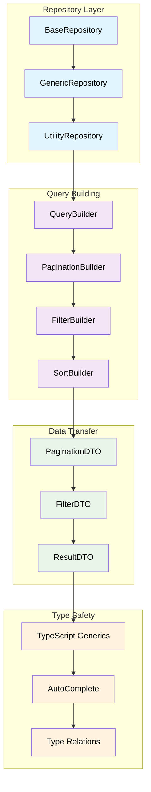
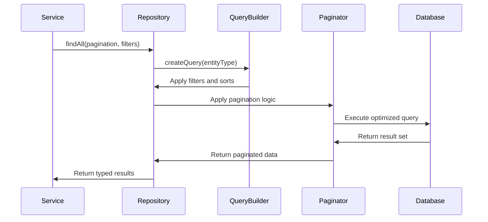
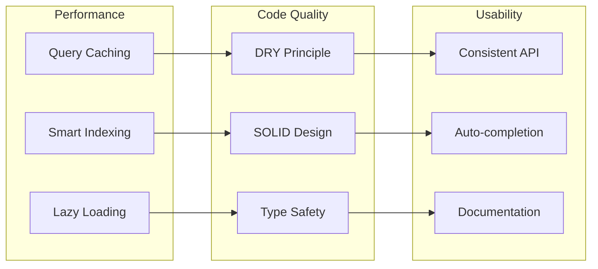

# TASK-1.3: Enhanced Generic Repository Helper

**Epic**: [EPIC-001] Foundation Setup
**Story**: [STORY-001] Foundation Architecture
**Effort**: 5 Story Points (~5 hours)
**Prerequisites**: Enhanced Base Entity (TASK-1.1) and Division-aware Soft Delete (TASK-1.2)

## 🎯 Task Objective

Create a comprehensive dual-layer generic repository system with BaseRepository for common operations and AnagraficaRepository for business entities, providing type-safe data access patterns with division awareness, uniqueness constraint enforcement, automatic case conversion, and advanced pagination capabilities.

## ✅ Acceptance Criteria

### **Core Requirements**

- [ ] Generic TypeORM repository with type safety
- [ ] Standard CRUD operations (findById, findAll, create, update, delete)
- [ ] Advanced pagination with offset, limit, and cursor support
- [ ] Filtering and sorting capabilities
- [ ] Relationship loading (eager/lazy) support
- [ ] Full TypeScript auto-completion preservation

### **Technical Requirements**

- [ ] Generic utility class extending TypeORM Repository
- [ ] Pagination DTOs with validation
- [ ] Query builder integration for complex queries
- [ ] Performance optimization with proper indexing
- [ ] Test coverage ≥ 85% for all repository methods

### **Business Requirements**

- [ ] Consistent API patterns across all entities
- [ ] Efficient handling of large datasets
- [ ] Flexible search and filter mechanisms
- [ ] Support for audit and soft delete integration

## 🏗️ Generic Repository Architecture



## 🧪 TDD Red-Green-Refactor Approach

### **🔴 Red Phase: Failing Tests**

```typescript
// Test structure (pseudo-code)
describe('Generic Repository Helper', () => {
  describe('CRUD Operations', () => {
    it('should find entity by ID with type safety');
    it('should find all entities with pagination');
    it('should create entity with validation');
    it('should update entity preserving audit fields');
    it('should soft delete entity (no hard delete)');
  });

  describe('Pagination', () => {
    it('should paginate with offset and limit');
    it('should paginate with cursor-based approach');
    it('should calculate total count efficiently');
    it('should handle empty result sets');
  });

  describe('Filtering and Sorting', () => {
    it('should filter by multiple criteria');
    it('should sort by multiple fields');
    it('should combine filters with logical operators');
  });

  describe('Type Safety', () => {
    it('should preserve TypeScript auto-completion');
    it('should validate entity types at compile time');
    it('should handle relationship types correctly');
  });
});
```

### **🟢 Green Phase: Implementation Flow**



### **🔧 Refactor Phase: Optimization**



## 📋 Detailed Implementation Steps

### **Step 1: Generic Repository Base**

**Pseudo-code Pattern:**

```
interface IGenericRepository<T extends BaseEntity> {
  + findById(id: string, options?): Promise<T | null>
  + findAll(pagination?, filters?, sorts?): Promise<PaginatedResult<T>>
  + create(data: Partial<T>): Promise<T>
  + update(id: string, data: Partial<T>): Promise<T>
  + delete(id: string, userId: string, reason?: string): Promise<void>

  // Advanced methods
  + findByIds(ids: string[]): Promise<T[]>
  + count(filters?): Promise<number>
  + exists(id: string): Promise<boolean>
  + findAndCount(pagination?, filters?): Promise<[T[], number]>
}

class GenericRepository<T extends BaseEntity>
  extends Repository<T>
  implements IGenericRepository<T> {

  constructor(
    private entityClass: EntityTarget<T>,
    manager: EntityManager
  ) {
    super(entityClass, manager);
  }
}
```

### **Step 2: Pagination System**

**Pagination DTOs:**

```
class PaginationOptionsDto {
  @Type(() => Number)
  @IsOptional()
  @Min(1)
  page?: number = 1

  @Type(() => Number)
  @IsOptional()
  @Min(1)
  @Max(100)
  limit?: number = 10

  @IsOptional()
  cursor?: string

  @IsOptional()
  @IsEnum(PaginationType)
  type?: PaginationType = PaginationType.OFFSET
}

class PaginatedResultDto<T> {
  data: T[]
  total: number
  page: number
  limit: number
  totalPages: number
  hasNext: boolean
  hasPrevious: boolean
  cursor?: string
}
```

### **Step 3: Query Builder Integration**

**Advanced Query Builder:**

```
class QueryBuilderHelper<T extends BaseEntity> {
  + applyFilters(qb: SelectQueryBuilder<T>, filters: FilterDto[]): SelectQueryBuilder<T>
  + applySorts(qb: SelectQueryBuilder<T>, sorts: SortDto[]): SelectQueryBuilder<T>
  + applyPagination(qb: SelectQueryBuilder<T>, pagination: PaginationOptionsDto): SelectQueryBuilder<T>
  + applyRelations(qb: SelectQueryBuilder<T>, relations: string[]): SelectQueryBuilder<T>

  // Advanced features
  + buildWhereClause(filters: FilterDto[]): string
  + optimizeQuery(qb: SelectQueryBuilder<T>): SelectQueryBuilder<T>
  + addSecurityFilters(qb: SelectQueryBuilder<T>, user: UserContext): SelectQueryBuilder<T>
}
```

### **Step 4: Type-Safe Utility Extension**

**Type Safety Preservation:**

```
class TypedRepository<T extends BaseEntity> extends GenericRepository<T> {
  // Preserve auto-completion for entity properties
  + findByField<K extends keyof T>(
      field: K,
      value: T[K],
      options?: FindOptions
    ): Promise<T[]>

  + updateField<K extends keyof T>(
      id: string,
      field: K,
      value: T[K]
    ): Promise<T>

  // Relationship handling with type safety
  + findWithRelations<R extends keyof T>(
      id: string,
      relations: R[]
    ): Promise<T & Pick<T, R>>
}
```

### **Step 5: Pagination Optimization**

**Cursor-based Pagination:**

```
class CursorPaginator<T extends BaseEntity> {
  + paginate(
      qb: SelectQueryBuilder<T>,
      options: CursorPaginationOptions
    ): Promise<CursorPaginatedResult<T>>

  + encodeCursor(entity: T): string
  + decodeCursor(cursor: string): CursorData
  + applyCursorWhere(qb: SelectQueryBuilder<T>, cursor: CursorData): void
}

// Performance optimization for large datasets
class OffsetPaginator<T extends BaseEntity> {
  + paginate(
      qb: SelectQueryBuilder<T>,
      options: OffsetPaginationOptions
    ): Promise<OffsetPaginatedResult<T>>

  + optimizeCountQuery(qb: SelectQueryBuilder<T>): Promise<number>
  + useWindowFunction(qb: SelectQueryBuilder<T>): SelectQueryBuilder<T>
}
```

## 🧪 Test Strategy

### **Unit Tests (70%)**

- Generic repository CRUD operations
- Pagination logic validation
- Type safety verification
- Filter and sort functionality
- Query optimization

### **Integration Tests (25%)**

- Database interaction testing
- Complex query scenarios
- Performance benchmarking
- Relationship loading
- Transaction handling

### **E2E Tests (5%)**

- Complete repository workflows
- Multi-entity operations
- Performance under load

## ✅ Definition of Done

### **Functional Completion**

- ✅ Generic repository with all CRUD operations
- ✅ Pagination system (offset and cursor)
- ✅ Advanced filtering and sorting
- ✅ Type safety preserved throughout
- ✅ Auto-completion working correctly

### **Quality Gates**

- ✅ Test coverage ≥ 85%
- ✅ Performance benchmarks met
- ✅ Type safety validation passed
- ✅ Code review completed
- ✅ Documentation comprehensive

### **Technical Validation**

- ✅ Zero TypeScript compilation errors
- ✅ Auto-completion working in IDEs
- ✅ Query performance optimized
- ✅ Memory usage within limits

## 🔧 Troubleshooting Guide

### **Common Issues & Solutions**

**Issue**: Lost TypeScript auto-completion
**Solution**: Use proper generic constraints and mapped types

**Issue**: Poor query performance with large datasets
**Solution**: Implement query optimization, proper indexing, cursor pagination

**Issue**: Complex filtering not working
**Solution**: Enhance QueryBuilder with advanced where clause building

**Issue**: Relationship loading issues
**Solution**: Implement lazy/eager loading strategies, optimize N+1 queries

## 📊 Success Metrics

### **Performance Targets**

- Simple queries: <50ms
- Paginated queries: <100ms
- Complex filtered queries: <200ms
- Bulk operations: <1s per 1000 records

### **Quality Targets**

- 100% TypeScript type coverage
- Zero auto-completion regressions
- 85%+ test coverage
- Zero memory leaks in pagination

## 🔗 Dependencies & Integration

### **Requires (Input Dependencies)**

- ✅ TASK-1.1: Base Entity with timezone management
- ✅ TASK-1.2: Soft Delete implementation
- TypeORM configured and working
- Database with proper indexing

### **Provides (Output Dependencies)**

- Generic repository pattern for all entities
- Consistent pagination across application
- Type-safe data access layer
- Performance-optimized queries

### **Enables Next Tasks**

- **TASK-1.4**: Transaction Management
- All future entity repositories
- Service layer implementations
- API controller development

## 📝 Implementation Notes

### **Performance Optimizations**

- Use database indices for common query patterns
- Implement query result caching
- Optimize pagination with window functions
- Use connection pooling effectively

### **Type Safety Considerations**

- Preserve generic type information throughout chain
- Use mapped types for dynamic property access
- Implement runtime type validation where needed
- Maintain IntelliSense support

### **Scalability Preparations**

- Design for horizontal database scaling
- Implement query sharding strategies
- Prepare for read replicas
- Plan for distributed caching

---

**🎯 Ready to implement enterprise-grade generic repository with full type safety**
