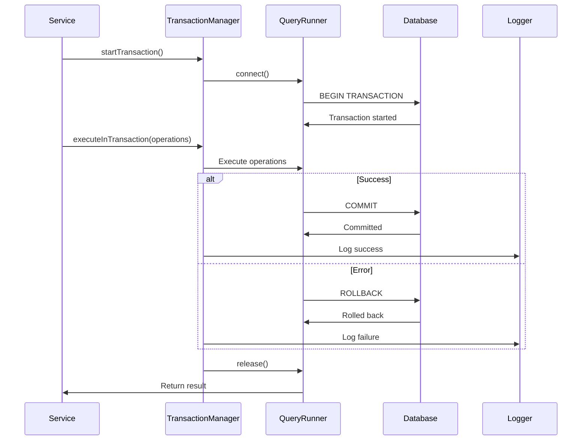
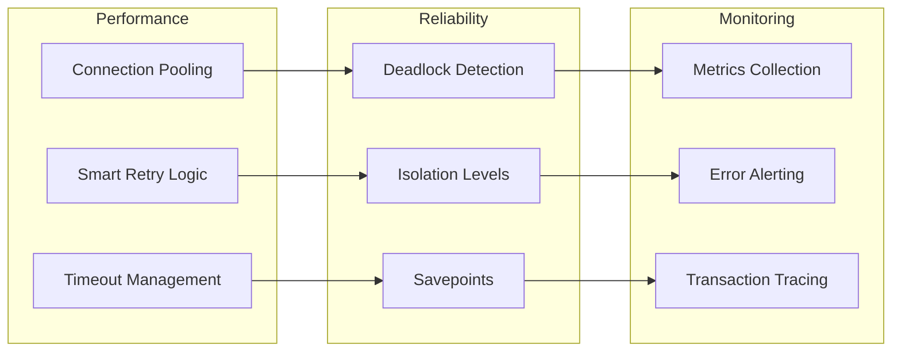

# TASK-1.4: Enhanced Transaction Management

**Epic**: [EPIC-001] Foundation Setup
**Story**: [STORY-001] Foundation Architecture
**Effort**: 4 Story Points (~4 hours)
**Prerequisites**: Enhanced Base Entity, Division-aware Soft Delete, and Enhanced Generic Repository (TASK-1.1, 1.2, 1.3)

## 🎯 Task Objective

Implement enterprise-grade ACID transaction utilities with enhanced support for division-aware operations, AnagraficaBaseEntity constraints, automatic case conversion, and comprehensive error handling for the dual-layer entity architecture with proper commit/release/rollback mechanisms.

## ✅ Acceptance Criteria

### **Core Requirements**

- [ ] ACID-compliant transaction wrapper utilities
- [ ] Automatic commit/rollback based on operation success/failure
- [ ] Deadlock detection and retry mechanisms
- [ ] Transaction isolation level management
- [ ] Nested transaction support (savepoints)
- [ ] Connection pooling integration

### **Technical Requirements**

- [ ] TypeORM QueryRunner integration
- [ ] Declarative transaction decorators
- [ ] Async/await transaction support
- [ ] Transaction timeout handling
- [ ] Performance monitoring and logging
- [ ] Test coverage ≥ 85% for transaction flows

### **Business Requirements**

- [ ] Data consistency guarantees
- [ ] Rollback safety for critical operations
- [ ] Audit trail for transaction events
- [ ] Performance optimization for high-load scenarios

## 🏗️ Transaction Management Architecture

```mermaid
graph TB
    subgraph "Transaction Layer"
        TM[TransactionManager]
        TW[TransactionWrapper]
        TS[TransactionService]
    end

    subgraph "Database Layer"
        QR[QueryRunner]
        CP[Connection Pool]
        DB[PostgreSQL]
    end

    subgraph "Monitoring"
        LOG[Transaction Logger]
        PERF[Performance Monitor]
        ERR[Error Handler]
    end

    subgraph "Decorators"
        TD[@Transaction]
        RD[@Rollback]
        SD[@Savepoint]
    end

    TM --> TW
    TW --> TS
    TS --> QR
    QR --> CP
    CP --> DB

    TM --> LOG
    TW --> PERF
    TS --> ERR

    TD --> TM
    RD --> TW
    SD --> TS

    classDef transaction fill:#e1f5fe,color:#000
    classDef database fill:#f3e5f5,color:#000
    classDef monitoring fill:#e8f5e8,color:#000
    classDef decorator fill:#fff3e0,color:#000

    class TM,TW,TS transaction
    class QR,CP,DB database
    class LOG,PERF,ERR monitoring
    class TD,RD,SD decorator
```

## 🧪 TDD Red-Green-Refactor Approach

### **🔴 Red Phase: Failing Tests**

```typescript
// Test structure (pseudo-code)
describe('Transaction Management', () => {
  describe('Basic Transactions', () => {
    it('should commit successful operations');
    it('should rollback failed operations');
    it('should handle connection errors gracefully');
    it('should respect transaction timeouts');
  });

  describe('Nested Transactions', () => {
    it('should handle savepoints correctly');
    it('should rollback to savepoint on partial failure');
    it('should commit nested transactions properly');
  });

  describe('Deadlock Handling', () => {
    it('should detect deadlocks');
    it('should retry transactions on deadlock');
    it('should fail after max retry attempts');
  });

  describe('Performance Monitoring', () => {
    it('should log transaction duration');
    it('should track transaction success/failure rates');
    it('should monitor connection pool usage');
  });
});
```

### **🟢 Green Phase: Implementation Flow**



### **🔧 Refactor Phase: Optimization**



## 📋 Detailed Implementation Steps

### **Step 1: Core Transaction Manager**

**Pseudo-code Pattern:**

```
interface ITransactionManager {
  + startTransaction(options?): Promise<Transaction>
  + executeInTransaction<T>(operation: TransactionOperation<T>): Promise<T>
  + commit(transaction: Transaction): Promise<void>
  + rollback(transaction: Transaction): Promise<void>
  + createSavepoint(transaction: Transaction, name: string): Promise<Savepoint>
  + rollbackToSavepoint(savepoint: Savepoint): Promise<void>
}

class TransactionManager implements ITransactionManager {
  constructor(
    private dataSource: DataSource,
    private logger: Logger,
    private monitor: PerformanceMonitor
  ) {}

  async executeInTransaction<T>(
    operation: TransactionOperation<T>,
    options?: TransactionOptions
  ): Promise<T> {
    const startTime = Date.now()
    const queryRunner = this.dataSource.createQueryRunner()

    try {
      await queryRunner.connect()
      await queryRunner.startTransaction(options?.isolationLevel)

      const result = await operation(queryRunner.manager)

      await queryRunner.commitTransaction()
      this.monitor.recordSuccess(Date.now() - startTime)

      return result
    } catch (error) {
      await queryRunner.rollbackTransaction()
      this.monitor.recordFailure(Date.now() - startTime, error)
      throw error
    } finally {
      await queryRunner.release()
    }
  }
}
```

### **Step 2: Transaction Decorators**

**Decorator Implementation:**

```
function Transaction(options?: TransactionOptions) {
  return function (target: any, propertyName: string, descriptor: PropertyDescriptor) {
    const method = descriptor.value

    descriptor.value = async function (...args: any[]) {
      const transactionManager = Container.get(TransactionManager)

      return transactionManager.executeInTransaction(
        async (manager: EntityManager) => {
          // Replace repository with transactional one
          const originalRepos = this.replaceRepositories(manager)

          try {
            return await method.apply(this, args)
          } finally {
            this.restoreRepositories(originalRepos)
          }
        },
        options
      )
    }
  }
}

// Usage example
class UserService {
  @Transaction({ isolationLevel: 'READ_COMMITTED' })
  async createUserWithProfile(userData: CreateUserDto): Promise<User> {
    // This method will run in a transaction
    const user = await this.userRepository.create(userData)
    const profile = await this.profileRepository.create({ userId: user.id })
    return user
  }
}
```

### **Step 3: Deadlock Detection and Retry**

**Retry Logic:**

```
class DeadlockHandler {
  static readonly MAX_RETRIES = 3
  static readonly RETRY_DELAY_MS = 100

  static async withRetry<T>(
    operation: () => Promise<T>,
    maxRetries: number = DeadlockHandler.MAX_RETRIES
  ): Promise<T> {
    let lastError: Error

    for (let attempt = 0; attempt <= maxRetries; attempt++) {
      try {
        return await operation()
      } catch (error) {
        lastError = error

        if (this.isDeadlock(error) && attempt < maxRetries) {
          await this.delay(this.calculateBackoff(attempt))
          continue
        }

        throw error
      }
    }

    throw lastError
  }

  private static isDeadlock(error: Error): boolean {
    return error.message.includes('deadlock detected') ||
           error.message.includes('Lock wait timeout')
  }

  private static calculateBackoff(attempt: number): number {
    return this.RETRY_DELAY_MS * Math.pow(2, attempt) + Math.random() * 100
  }
}
```

### **Step 4: Savepoint Management**

**Nested Transaction Support:**

```
class SavepointManager {
  private savepoints: Map<string, Savepoint> = new Map()

  async createSavepoint(
    queryRunner: QueryRunner,
    name: string
  ): Promise<Savepoint> {
    const savepoint = new Savepoint(name, queryRunner)
    await queryRunner.query(`SAVEPOINT ${name}`)

    this.savepoints.set(name, savepoint)
    return savepoint
  }

  async rollbackToSavepoint(name: string): Promise<void> {
    const savepoint = this.savepoints.get(name)
    if (!savepoint) {
      throw new Error(`Savepoint ${name} not found`)
    }

    await savepoint.queryRunner.query(`ROLLBACK TO SAVEPOINT ${name}`)
  }

  async releaseSavepoint(name: string): Promise<void> {
    const savepoint = this.savepoints.get(name)
    if (savepoint) {
      await savepoint.queryRunner.query(`RELEASE SAVEPOINT ${name}`)
      this.savepoints.delete(name)
    }
  }
}
```

### **Step 5: Performance Monitoring**

**Transaction Metrics:**

```
class TransactionMonitor {
  private metrics: TransactionMetrics = {
    totalTransactions: 0,
    successfulTransactions: 0,
    failedTransactions: 0,
    averageDuration: 0,
    deadlockCount: 0,
    timeoutCount: 0
  }

  recordSuccess(durationMs: number): void {
    this.metrics.totalTransactions++
    this.metrics.successfulTransactions++
    this.updateAverageDuration(durationMs)
  }

  recordFailure(durationMs: number, error: Error): void {
    this.metrics.totalTransactions++
    this.metrics.failedTransactions++

    if (this.isDeadlock(error)) {
      this.metrics.deadlockCount++
    }

    if (this.isTimeout(error)) {
      this.metrics.timeoutCount++
    }

    this.updateAverageDuration(durationMs)
  }

  getHealthMetrics(): TransactionHealthMetrics {
    return {
      successRate: this.metrics.successfulTransactions / this.metrics.totalTransactions,
      averageDuration: this.metrics.averageDuration,
      deadlockRate: this.metrics.deadlockCount / this.metrics.totalTransactions,
      timeoutRate: this.metrics.timeoutCount / this.metrics.totalTransactions
    }
  }
}
```

## 🧪 Test Strategy

### **Unit Tests (60%)**

- Transaction manager methods
- Decorator functionality
- Deadlock detection logic
- Savepoint management
- Error handling scenarios

### **Integration Tests (35%)**

- Database transaction flows
- Connection pool interaction
- Performance under load
- Multi-threaded scenarios
- Timeout handling

### **E2E Tests (5%)**

- Complete business workflows
- Multi-service transactions
- Disaster recovery scenarios

## ✅ Definition of Done

### **Functional Completion**

- ✅ Transaction manager with ACID compliance
- ✅ Deadlock detection and retry implemented
- ✅ Savepoint support for nested transactions
- ✅ Transaction decorators working
- ✅ Performance monitoring active

### **Quality Gates**

- ✅ Test coverage ≥ 85%
- ✅ Performance benchmarks met
- ✅ Zero data consistency issues
- ✅ Code review passed
- ✅ Documentation complete

### **Technical Validation**

- ✅ Connection pooling optimized
- ✅ Transaction timeouts configured
- ✅ Error handling comprehensive
- ✅ Monitoring metrics accurate

## 🔧 Troubleshooting Guide

### **Common Issues & Solutions**

**Issue**: Transaction deadlocks under high load
**Solution**: Implement exponential backoff retry, optimize query order

**Issue**: Connection pool exhaustion
**Solution**: Monitor pool metrics, implement connection timeouts

**Issue**: Long-running transactions blocking others
**Solution**: Implement transaction timeouts, break down large operations

**Issue**: Savepoint naming conflicts
**Solution**: Use UUID-based savepoint names, implement cleanup

## 📊 Success Metrics

### **Performance Targets**

- Transaction overhead: <10ms additional latency
- Deadlock retry success rate: >95%
- Connection pool efficiency: >90% utilization
- Transaction timeout rate: <1%

### **Reliability Targets**

- Zero data corruption incidents
- 99.9% transaction success rate
- <5% rollback rate for business operations
- 100% ACID compliance

## 🔗 Dependencies & Integration

### **Requires (Input Dependencies)**

- ✅ TASK-1.1: Base Entity with timezone management
- ✅ TASK-1.2: Soft Delete implementation
- ✅ TASK-1.3: Generic Repository Helper
- PostgreSQL database with proper configuration
- TypeORM with connection pooling

### **Provides (Output Dependencies)**

- Transaction management for all business operations
- ACID compliance guarantees
- Deadlock resilience
- Performance monitoring foundation

### **Enables Next Tasks**

- All business logic implementations
- Multi-entity operations
- Batch processing capabilities
- Data migration utilities

## 📝 Implementation Notes

### **Security Considerations**

- Validate transaction permissions
- Log all transaction events for audit
- Implement timeout limits to prevent resource exhaustion
- Monitor for suspicious transaction patterns

### **Performance Optimizations**

- Use connection pooling effectively
- Implement read-only transaction optimization
- Batch related operations within transactions
- Monitor and optimize long-running transactions

### **Scalability Preparations**

- Design for distributed transactions (2PC)
- Plan for database sharding scenarios
- Implement transaction routing for read replicas
- Prepare for microservices transaction coordination

---

**🎯 Ready to implement enterprise-grade ACID transaction management with comprehensive monitoring**
