# STORY-2: Users Module Implementation

**Epic**: [EPIC-002] Users Management System
**Total Effort**: 14 Story Points (~2-3 days for senior developer)
**Prerequisites**: Foundation setup completed (Story 1)

## 🎯 Story Objective

Implement a complete Users management system with authentication, providing a secure foundation for the Task Management API. This includes user registration, login, profile management, and JWT-based authentication with role-based access control.

## 🏗️ Story Architecture

```mermaid
graph TB
    subgraph "Story 2: Users Module"
        T1[TASK-2.1: User Entity<br/>3h - Database Schema]
        T2[TASK-2.2: User Service<br/>4h - Business Logic]
        T3[TASK-2.3: User Controller<br/>3h - API Endpoints]
        T4[TASK-2.4: Auth Service<br/>4h - JWT Integration]
    end

    T1 --> T2
    T2 --> T3
    T3 --> T4

    subgraph "Dependencies"
        S1[✅ Story 1: Foundation]
        S1 --> T1
    end

    subgraph "Outputs"
        AUTH[🔐 Authentication System]
        API[📡 User Management API]
        SECURITY[🛡️ Role-based Security]

        T4 --> AUTH
        T3 --> API
        T4 --> SECURITY
    end

    classDef completed fill:#28a745,color:#fff
    classDef ready fill:#007bff,color:#fff
    classDef output fill:#17a2b8,color:#fff

    class S1 completed
    class T1,T2,T3,T4 ready
    class AUTH,API,SECURITY output
```



## ✅ Story Acceptance Criteria

### Functional Requirements

- [ ] Users can register with email/password
- [ ] Users can login and receive JWT tokens
- [ ] Users can update their profile information
- [ ] Users can change their password securely
- [ ] Admin users can manage other users
- [ ] JWT tokens expire and can be refreshed
- [ ] Password security with bcrypt hashing

### Technical Requirements

- [ ] RESTful API endpoints following OpenAPI 3.0
- [ ] Comprehensive Swagger documentation
- [ ] Database schema with proper constraints
- [ ] Role-based access control (RBAC)
- [ ] Input validation and error handling
- [ ] Test coverage ≥ 85% per module
- [ ] Integration with existing NestJS architecture

### Security Requirements

- [ ] Password hashing with bcrypt (salt rounds ≥ 12)
- [ ] JWT token security with short expiration
- [ ] Refresh token mechanism
- [ ] Input sanitization and validation
- [ ] No password exposure in API responses
- [ ] Protection against common vulnerabilities

## 📋 Task Breakdown

### **TASK-2.1: User Entity & Database Schema** (3 hours)

**Focus**: Database foundation and security

- **Deliverables**:
  - User entity with TypeORM decorators
  - Password hashing with lifecycle hooks
  - Database migration for users table
  - Entity validation and constraints

- **Key Features**:
  - UUID primary key
  - Email uniqueness constraint
  - Password hashing automation
  - User roles and status enums
  - Audit timestamps

- **Tests**: Entity validation, password hashing, database constraints

### **TASK-2.2: User Service & Repository Pattern** (4 hours)

**Focus**: Business logic and data operations

- **Deliverables**:
  - UserService with CRUD operations
  - Custom repository with advanced queries
  - DTOs for request/response validation
  - Error handling and business rules

- **Key Features**:
  - Pagination and search functionality
  - Password change validation
  - User status management
  - Transaction support

- **Tests**: Service methods, business logic, integration tests

### **TASK-2.3: User Controller & API Endpoints** (3 hours)

**Focus**: REST API and documentation

- **Deliverables**:
  - RESTful User controller
  - Swagger/OpenAPI documentation
  - Request/response DTOs
  - HTTP status code handling

- **Key Features**:
  - Full CRUD operations
  - Pagination support
  - Search functionality
  - Proper error responses

- **Tests**: Controller methods, E2E API tests, validation

### **TASK-2.4: Authentication Service & JWT Integration** (4 hours)

**Focus**: Security and authentication

- **Deliverables**:
  - Authentication service
  - JWT strategy implementation
  - Auth guards and decorators
  - Login/register endpoints

- **Key Features**:
  - JWT token generation/validation
  - Refresh token mechanism
  - Role-based guards
  - Password verification

- **Tests**: Auth flows, security validation, JWT handling

## 🎯 Value Proposition

### **Business Value**

- **User Management**: Complete user lifecycle management
- **Security Foundation**: Enterprise-grade authentication
- **Scalability**: Role-based access for future features
- **API First**: RESTful design for frontend integration

### **Technical Value**

- **Reusable Components**: Auth system for entire application
- **Security Best Practices**: Industry-standard JWT implementation
- **Documentation**: Comprehensive API documentation
- **Test Coverage**: High quality with extensive testing

## 🔄 TDD Workflow per Task

### **Red-Green-Refactor Cycle**

```
🔴 RED PHASE (Write failing tests):
   - Define expected behavior
   - Create comprehensive test scenarios
   - Ensure tests fail for right reasons

🟢 GREEN PHASE (Make tests pass):
   - Implement minimal working code
   - Focus on functionality, not perfection
   - Ensure all tests pass

🔧 REFACTOR PHASE (Improve code quality):
   - Apply SOLID principles
   - Optimize performance
   - Enhance maintainability
   - Keep all tests green
```

### **Testing Strategy**

- **Unit Tests**: Individual components (services, controllers)
- **Integration Tests**: Database interactions, module integration
- **E2E Tests**: Complete API workflows
- **Security Tests**: Authentication flows, authorization rules

## 🚀 Definition of Done (Story Level)

### **Functional Completion**

- ✅ All task acceptance criteria met
- ✅ All API endpoints functional and documented
- ✅ Authentication system working end-to-end
- ✅ User management operations complete

### **Quality Gates**

- ✅ Test coverage ≥ 85% across all modules
- ✅ All tests passing (unit, integration, E2E)
- ✅ Code review completed
- ✅ Security validation passed

### **Documentation**

- ✅ Swagger/OpenAPI documentation complete
- ✅ README updated with auth instructions
- ✅ Database schema documented
- ✅ API usage examples provided

### **Integration**

- ✅ Module integration with existing codebase
- ✅ Environment configuration updated
- ✅ CI/CD pipeline passing
- ✅ Performance benchmarks met

## 🔗 Dependencies & Blockers

### **Prerequisites (Met)**

- ✅ NestJS foundation setup (Story 1)
- ✅ Database configuration
- ✅ Testing framework configured
- ✅ Quality gates established

### **Dependencies for Future Stories**

- **Story 3**: Task management will depend on user authentication
- **Story 4**: Production deployment will use auth system
- **Story 5**: Advanced features will extend user roles

## 📊 Success Metrics

### **Technical Metrics**

- **Test Coverage**: Target ≥ 85%
- **API Response Time**: <200ms for auth operations
- **Security Compliance**: Zero critical vulnerabilities
- **Code Quality**: SonarJS quality gate passed

### **Functional Metrics**

- **API Completeness**: All CRUD operations working
- **Authentication Success Rate**: >99%
- **Documentation Quality**: All endpoints documented
- **Error Handling**: Proper HTTP status codes

## 🧪 Test Strategy Summary

### **Test Distribution**

- **Unit Tests**: ~60% (individual methods and functions)
- **Integration Tests**: ~25% (service-database interactions)
- **E2E Tests**: ~15% (complete user workflows)

### **Test Coverage Targets**

- **User Entity**: 90%+ (critical security component)
- **User Service**: 85%+ (business logic validation)
- **User Controller**: 85%+ (API behavior verification)
- **Auth Service**: 90%+ (security critical paths)

---

## 📝 Implementation Notes

### **Security Considerations**

- Use environment variables for all secrets
- Implement rate limiting on auth endpoints
- Add audit logging for security events
- Consider implementing account lockout policies

### **Performance Considerations**

- Index email field for fast lookups
- Use connection pooling for database
- Implement caching strategy for user data
- Monitor JWT token validation performance

### **Scalability Preparations**

- Design for horizontal scaling
- Consider distributed session management
- Plan for user data partitioning
- Prepare for microservices evolution

---

**🎯 Ready to begin implementation with TASK-2.1: User Entity & Database Schema**
