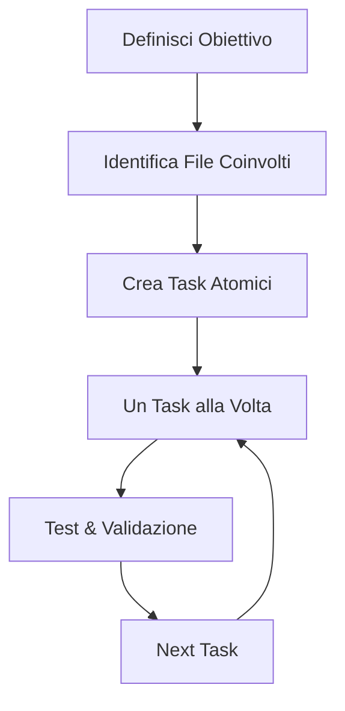

# Guida Completa per Utilizzare GitHub Copilot al Meglio

## 📖 Indice

1. [Introduzione](#introduzione)
2. [Principi Fondamentali](#principi-fondamentali)
3. [Strutturare File e Task Atomici](#strutturare-file-e-task-atomici)
4. [Tecniche di Prompt Engineering](#tecniche-di-prompt-engineering)
5. [Workflow Ottimali](#workflow-ottimali)
6. [Esempi Pratici](#esempi-pratici)
7. [Anti-Pattern da Evitare](#anti-pattern-da-evitare)
8. [Troubleshooting](#troubleshooting)

## 🎯 Introduzione

GitHub Copilot è un assistente AI che funziona meglio quando riceve **contesto chiaro**, **task specifici** e **istruzioni strutturate**. Questa guida ti insegna come massimizzare la produttività attraverso task atomici e comunicazione efficace.

## 🔑 Principi Fondamentali

### 1. **Atomicità dei Task**

Ogni richiesta dovrebbe avere **un singolo obiettivo chiaro**:

```markdown
❌ BAD: "Crea l'autenticazione, il database e i test"
✅ GOOD: "Crea il middleware di autenticazione JWT per proteggere le route API"
```

### 2. **Contesto Prima dell'Azione**

Fornisci sempre il contesto prima di chiedere modifiche:

```markdown
✅ GOOD:
"Nel file src/auth/auth.service.ts, ho un metodo validateUser() che controlla username/password.
Voglio aggiungere il supporto per l'autenticazione via email invece che username."
```

### 3. **Specificità vs Genericità**

Sii specifico sui dettagli tecnici ma lascia spazio alla creatività:

```markdown
✅ GOOD: "Crea un interceptor NestJS che logga automaticamente tutte le richieste HTTP
includendo: metodo, URL, IP client, user-agent e tempo di risposta"
```

## 📁 Strutturare File e Task Atomici

### Task Atomici Perfetti

#### ✅ Esempio 1: Feature Specifica

```markdown
**Obiettivo**: Implementare validazione email nel DTO di registrazione

**Contesto**:

- File: src/auth/dto/register.dto.ts
- Framework: NestJS con class-validator
- Requirement: Email deve essere valida e unica nel database

**Acceptance Criteria**:

- [ ] Decoratore @IsEmail() applicato al campo email
- [ ] Validazione custom per unicità email
- [ ] Messaggio di errore localizzato in italiano
- [ ] Test unitario per la validazione
```

#### ✅ Esempio 2: Refactoring Mirato

```markdown
**Obiettivo**: Estrarre la logica di hashing password in un service dedicato

**Contesto**:

- Attualmente in: src/auth/auth.service.ts (righe 45-62)
- Pattern: Dependency Injection NestJS
- Crypto: bcrypt per hashing

**Output Atteso**:

- Nuovo file: src/auth/password.service.ts
- Metodi: hashPassword(), comparePassword()
- Update AuthService per usare il nuovo service
```

### Struttura File Atomica

#### 📄 Un Concept per File

```typescript
// ✅ GOOD: user.entity.ts - Solo l'entità User
@Entity('users')
export class User {
  @PrimaryGeneratedColumn()
  id: number;
  // ... altre proprietà
}

// ❌ BAD: user.ts - Entità + DTO + Service mixed
```

#### 📄 Responsabilità Singola

```typescript
// ✅ GOOD: email.validator.ts - Solo validazione email
export class EmailValidator {
  static isValid(email: string): boolean {
    /* ... */
  }
  static isUnique(email: string): Promise<boolean> {
    /* ... */
  }
}
```

## 🎨 Tecniche di Prompt Engineering

### 1. **Template STAR**

**S**ituation, **T**ask, **A**ction, **R**esult

```markdown
**Situation**: Ho un controller NestJS che gestisce upload di file
**Task**: Voglio aggiungere validazione della dimensione max file (5MB)
**Action**: Implementa un decorator custom @MaxFileSize()
**Result**: Il decorator deve rejectare file > 5MB con errore HTTP 413
```

### 2. **Contesto Progressivo**

Costruisci il contesto step-by-step:

```markdown
1. "Sto lavorando su un'API NestJS per gestione task"
2. "Ho un'entità Task con relazione Many-to-One verso User"
3. "Voglio implementare soft delete per i task"
4. "Il soft delete deve preservare le relazioni e essere trasparente nelle query"
```

### 3. **Esempi Input/Output**

Fornisci esempi concreti:

````markdown
**Input atteso**:

```json
{
  "title": "Completare documentazione",
  "description": "Aggiornare README con nuove funzionalità",
  "dueDate": "2025-09-20T10:00:00Z"
}
```
````

**Output atteso**:

```json
{
  "id": 123,
  "title": "Completare documentazione",
  "status": "pending",
  "createdAt": "2025-09-17T11:30:00Z"
}
```

## 🔄 Workflow Ottimali

### Workflow 1: Feature Development



### Workflow 2: Debug & Refactoring

```markdown
1. **Descrivi il Problema**: "Il metodo getUserTasks() è lento con grandi dataset"
2. **Mostra il Codice Attuale**: Incolla il metodo specifico
3. **Specifica l'Obiettivo**: "Ottimizzare con lazy loading e pagination"
4. **Definisci Metriche**: "Ridurre da 2s a <200ms per 1000+ tasks"
```

## 💡 Esempi Pratici

### Esempio A: Implementazione Endpoint API

**🎯 Prompt Ottimale**:

````markdown
Crea un endpoint GET /api/v1/users/:id/tasks per recuperare i task di un utente specifico.

**Contesto**:

- Controller: src/tasks/tasks.controller.ts
- Service: src/tasks/tasks.service.ts
- Entity: User has Many Tasks
- Framework: NestJS + TypeORM

**Requirements**:

- Paginazione (limit, offset)
- Filtro per status (pending, completed, cancelled)
- Ordinamento per dueDate
- Validazione che lo user esista
- Response DTO strutturato

**Response Format**:

```json
{
  "data": [...],
  "meta": {
    "total": 45,
    "page": 1,
    "limit": 10
  }
}
```
````

### Esempio B: Test Implementation

**🎯 Prompt Ottimale**:

````markdown
Scrivi test unitari per il metodo TasksService.createTask()

**Metodo da testare**:

```typescript
async createTask(userId: number, createTaskDto: CreateTaskDto): Promise<Task> {
  // ... implementazione esistente
}
```
````

**Test Scenarios**:

- ✅ Creazione task con dati validi
- ❌ User non esistente (throw NotFoundException)
- ❌ Dati invalidi (validation error)
- ✅ Relazione User-Task creata correttamente
- ✅ Audit fields (createdAt, updatedAt) popolati

**Setup**: Jest + TypeORM testing utilities

````

## 🚫 Anti-Pattern da Evitare

### ❌ Task Troppo Grandi
```markdown
BAD: "Crea tutto il modulo di autenticazione completo"

GOOD:
1. "Crea AuthModule base con imports/exports"
2. "Implementa JWT strategy per Passport"
3. "Crea AuthGuard per proteggere route"
4. "Aggiunge refresh token mechanism"
````

### ❌ Contesto Insufficiente

```markdown
BAD: "C'è un errore nel codice, fixalo"

GOOD: "Nel metodo UserService.updateProfile() riga 34,
il campo 'email' non viene validato prima dell'update.
Aggiungi validazione che l'email sia unica e formato valido."
```

### ❌ Richieste Ambigue

```markdown
BAD: "Migliora le performance"

GOOD: "Ottimizza la query getUsersWithTasks() utilizzando
JOIN invece di N+1 query. Attualmente impiega 1.2s per 100 users."
```

## 🛠️ Troubleshooting

### Problema: Copilot non capisce il contesto

**Soluzione**:

1. Condividi il file completo su cui stai lavorando
2. Spiega la struttura del progetto
3. Fornisci esempi di pattern usati altrove

### Problema: Suggerimenti non coerenti con il progetto

**Soluzione**:

1. Referenzia file esistenti: "Usa lo stesso pattern di auth.service.ts"
2. Specifica framework/librerie: "Con NestJS + TypeORM + Jest"
3. Menziona convenzioni: "Segui la naming convention existente"

### Problema: Output troppo generico

**Soluzione**:

1. Fornisci esempi input/output specifici
2. Specifica vincoli tecnici
3. Chiedi implementazione step-by-step

## 🏆 Best Practices Summary

1. **Un Obiettivo per Prompt** - Task atomici e focus singolo
2. **Contesto Prima di Tutto** - File, framework, requirements
3. **Esempi Concreti** - Input/output, use cases specifici
4. **Validazione Iterativa** - Test ogni step prima del successivo
5. **Pattern Consistency** - Referenzia codice esistente
6. **Metriche Specifiche** - Performance, validazioni, edge cases

## 🎯 Quick Reference

### Formato Task Atomico Ideale

```markdown
**Obiettivo**: [Una frase chiara]
**File**: [path/to/file.ts]  
**Contesto**: [Framework + situation]
**Input**: [Dati/parametri]
**Output**: [Risultato atteso]
**Validazione**: [Come testare]
```

### Checklist Pre-Prompt

- [ ] Obiettivo chiaro e specifico?
- [ ] Contesto tecnico fornito?
- [ ] File di riferimento identificati?
- [ ] Esempi input/output inclusi?
- [ ] Criteri di validazione definiti?

---

**Ricorda**: GitHub Copilot è un partner di sviluppo. Più preciso e strutturato sei nella comunicazione, migliori saranno i risultati! 🚀
