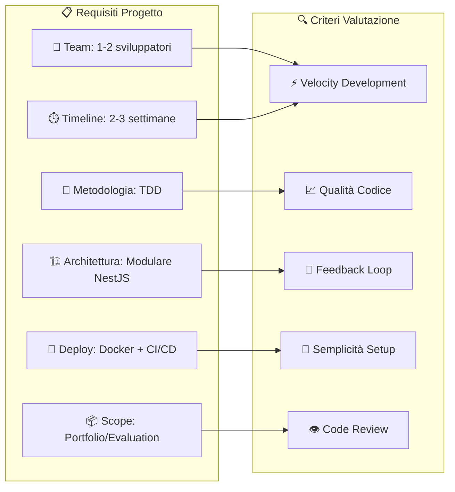
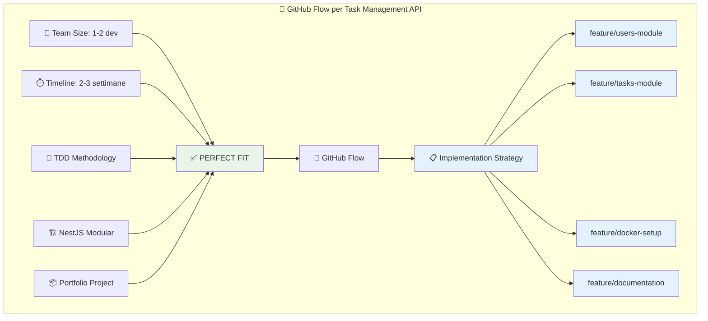

# Git Workflows: Guida Completa per la Scelta Ottimale

## 📋 Introduzione

La scelta del Git workflow è fondamentale per il successo di un progetto software. Ogni flusso ha caratteristiche specifiche che si adattano meglio a diversi contesti di team, progetto e metodologie di sviluppo.

Questo documento analizza i principali Git workflows disponibili e fornisce raccomandazioni specifiche per il progetto **Task Management API**.

---

## 🔄 1. GitFlow

### Descrizione

GitFlow è un workflow strutturato che utilizza branch dedicati per diverse tipologie di sviluppo e rilasci.

```mermaid
gitgraph:
    options:
        theme: base
        themeVariables:
            primaryColor: '#ff0000'
    commit id: "Initial commit"
    branch develop
    checkout develop
    commit id: "Setup project"

    branch feature/user-auth
    checkout feature/user-auth
    commit id: "Add user entity"
    commit id: "Add auth service"
    checkout develop
    merge feature/user-auth

    branch release/v1.0
    checkout release/v1.0
    commit id: "Bug fixes"
    commit id: "Version bump"

    checkout main
    merge release/v1.0
    commit id: "v1.0.0" tag: "v1.0.0"

    checkout develop
    merge release/v1.0
```

### Struttura Branch

- **`main`**: Codice di produzione stabile
- **`develop`**: Branch di integrazione per sviluppo
- **`feature/*`**: Sviluppo di nuove funzionalità
- **`release/*`**: Preparazione rilasci
- **`hotfix/*`**: Fix critici in produzione

### ✅ Vantaggi

- **Stabilità garantita**: Separazione netta tra sviluppo e produzione
- **Rilasci strutturati**: Processo controllato per i release
- **Tracciabilità**: Chiara cronologia delle modifiche
- **Supporto team grandi**: Gestione efficace di sviluppatori multipli
- **Rollback sicuri**: Facilità nel tornare a versioni stabili

### ❌ Svantaggi

- **Complessità elevata**: Molti branch da gestire
- **Overhead per piccoli team**: Troppo strutturato per 1-2 sviluppatori
- **Merge conflicts frequenti**: Maggiore probabilità di conflitti
- **Deploy lenti**: Processo di rilascio lungo
- **Learning curve**: Richiede comprensione approfondita

### 🎯 Quando Usarlo

- **Team grandi** (5+ sviluppatori)
- **Rilasci schedulati** (mensili/trimestrali)
- **Prodotti enterprise** con alta stabilità richiesta
- **Ambienti multipli** (staging, pre-prod, prod)
- **Compliance rigorosi** con audit trail dettagliati

### Best Practices GitFlow

```bash
# Setup iniziale
git flow init

# Feature development
git flow feature start user-authentication
git flow feature finish user-authentication

# Release preparation
git flow release start 1.0.0
git flow release finish 1.0.0

# Emergency fixes
git flow hotfix start critical-bug
git flow hotfix finish critical-bug
```

---

## 🚀 2. Trunk-based Development

### Descrizione

Sviluppo diretto su un singolo branch (trunk/main) con commit frequenti e feature flags.

```mermaid
gitgraph:
    options:
        theme: base
        themeVariables:
            primaryColor: '#00ff00'
    commit id: "Initial setup"
    commit id: "Add user entity"
    commit id: "Add auth service"
    commit id: "Add user tests"
    commit id: "Add task entity"
    commit id: "Add task service"
    commit id: "Add API docs"
    commit id: "Deploy v1.0" tag: "v1.0"
```

### Caratteristiche

- **Branch unico**: Tutti lavorano su `main`
- **Commit frequenti**: Minimo 1 commit al giorno
- **Feature flags**: Controllo rilascio funzionalità
- **CI/CD intensivo**: Deploy automatici continui

### ✅ Vantaggi

- **Semplicità massima**: Un solo branch da gestire
- **Deploy velocissimi**: Nessun overhead di merge
- **Integrazione continua**: Problemi rilevati subito
- **Velocity alta**: Nessun tempo perso in merge
- **Feedback rapido**: Testing continuo del codice

### ❌ Svantaggi

- **Rischio instabilità**: Main potenzialmente broken
- **Discipline richiesta**: Team deve essere molto esperto
- **Feature flags complexity**: Gestione flags complessa
- **Testing intensivo**: Necessita automazione perfetta
- **Review difficile**: Meno controllo qualità pre-commit

### 🎯 Quando Usarlo

- **Team senior esperti** con alta disciplina
- **Prodotti SaaS** con deploy multipli giornalieri
- **Metodologie DevOps mature** con automazione completa
- **Feature flags infrastructure** già presente
- **Testing automatizzato al 100%**

### Best Practices Trunk-based

```bash
# Commit frequenti e piccoli
git add .
git commit -m "feat: add user validation - atomic change"
git push origin main

# Feature flags per funzionalità incomplete
const FEATURE_TASK_SHARING = process.env.ENABLE_TASK_SHARING === 'true';

if (FEATURE_TASK_SHARING) {
  // Nuova funzionalità in sviluppo
}
```

---

## 🌊 3. GitHub Flow

### Descrizione

Workflow semplificato basato su feature branches con Pull Request obbligatorie.

```mermaid
gitgraph:
    options:
        theme: base
        themeVariables:
            primaryColor: '#0066cc'
    commit id: "Initial setup"

    branch feature/user-auth
    checkout feature/user-auth
    commit id: "Add user entity"
    commit id: "Add auth tests"
    commit id: "Fix auth logic"

    checkout main
    merge feature/user-auth
    commit id: "Deploy" tag: "deploy"

    branch feature/task-crud
    checkout feature/task-crud
    commit id: "Add task entity"
    commit id: "Add CRUD logic"

    checkout main
    merge feature/task-crud
    commit id: "Deploy" tag: "deploy"
```

### Processo

1. **Branch creation**: `feature/nome-funzionalità`
2. **Development**: Commits sulla feature branch
3. **Pull Request**: Review e discussione
4. **Merge**: Integrazione in `main`
5. **Deploy**: Automatico dopo merge

### ✅ Vantaggi

- **Semplicità**: Solo 2 tipi di branch (main + feature)
- **Quality gates**: PR obbligatorie con review
- **Deploy continui**: Ogni merge = deploy
- **Collaboration**: Discussione naturale tramite PR
- **Tool integration**: Ottimo supporto GitHub/GitLab

### ❌ Svantaggi

- **Main instabile**: Possibili problemi temporanei
- **Review bottleneck**: PR possono rallentare
- **Branch short-lived**: Pressione per merge veloci
- **Hotfix complexity**: Non gestisce bene le emergency

### 🎯 Quando Usarlo

- **Team piccoli-medi** (2-8 sviluppatori)
- **Deploy frequenti** (giornalieri/settimanali)
- **Progetti web/API** con CI/CD maturi
- **Review culture** consolidata nel team
- **Metodologie Agile** con sprint brevi

### Best Practices GitHub Flow

```bash
# Creazione feature branch
git checkout -b feature/user-authentication
git push -u origin feature/user-authentication

# Sviluppo con commit atomici
git add src/users/
git commit -m "feat(users): add user registration endpoint

- Add CreateUserDto with validation
- Implement bcrypt password hashing
- Add user repository with unique email constraint
- Include unit tests for registration flow"

# Pull Request con template
# Title: feat(users): implement user authentication system
# Description: [Detailed PR description with screenshots/demo]
```

---

## 🔀 4. GitLab Flow

### Descrizione

Workflow ibrido che combina GitHub Flow con environment branches per deployment staging.

```mermaid
gitgraph:
    options:
        theme: base
        themeVariables:
            primaryColor: '#6633cc'
    commit id: "Setup"

    branch feature/auth
    checkout feature/auth
    commit id: "Add auth"

    checkout main
    merge feature/auth

    branch staging
    checkout staging
    merge main
    commit id: "Deploy staging"

    branch production
    checkout production
    merge staging
    commit id: "Deploy prod" tag: "v1.0"
```

### Struttura

- **`main`**: Codice pronto per staging
- **`staging`**: Environment di testing
- **`production`**: Codice in produzione
- **`feature/*`**: Feature branches normali

### ✅ Vantaggi

- **Environment control**: Controllo granulare deployment
- **Testing stages**: Validazione multi-ambiente
- **Rollback facili**: Branch production separato
- **Release planning**: Deploy controllati in produzione

### ❌ Svantaggi

- **Complessità media**: Più branch di GitHub Flow
- **Sync overhead**: Mantenere branch allineati
- **Merge conflicts**: Potenziali conflitti tra environment

### 🎯 Quando Usarlo

- **Ambienti multipli** con testing rigoroso
- **Deploy schedulati** ma non troppo complessi
- **Team medi** che necessitano controllo release
- **Prodotti B2B** con stabilità critica

---

## 📊 Confronto Comparativo

| Aspetto               | GitFlow             | Trunk-based          | GitHub Flow | GitLab Flow    |
| --------------------- | ------------------- | -------------------- | ----------- | -------------- |
| **Complessità**       | ⭐⭐⭐⭐⭐          | ⭐                   | ⭐⭐        | ⭐⭐⭐         |
| **Team Size**         | 5-20+               | 3-10 (senior)        | 2-8         | 3-12           |
| **Deploy Frequency**  | Settimanale/Mensile | Multipli giornalieri | Giornaliero | Bi-settimanale |
| **Stabilità**         | ⭐⭐⭐⭐⭐          | ⭐⭐                 | ⭐⭐⭐      | ⭐⭐⭐⭐       |
| **Learning Curve**    | Alto                | Molto Alto           | Basso       | Medio          |
| **CI/CD Integration** | ⭐⭐⭐              | ⭐⭐⭐⭐⭐           | ⭐⭐⭐⭐    | ⭐⭐⭐⭐       |
| **Code Review**       | ⭐⭐⭐              | ⭐⭐                 | ⭐⭐⭐⭐⭐  | ⭐⭐⭐⭐       |
| **Hotfix Speed**      | ⭐⭐                | ⭐⭐⭐⭐⭐           | ⭐⭐⭐      | ⭐⭐⭐         |

---

## 🎯 Analisi per Task Management API

### Caratteristiche del Progetto



### Scoring per il Nostro Contesto

| Workflow        | Team Size ✅ | Timeline ✅ | TDD ✅   | Modulare ✅ | CI/CD ✅ | **SCORE** |
| --------------- | ------------ | ----------- | -------- | ----------- | -------- | --------- |
| **GitFlow**     | ❌ (2/5)     | ❌ (1/5)    | ✅ (4/5) | ✅ (4/5)    | ⭐ (3/5) | **14/25** |
| **Trunk-based** | ⚠️ (3/5)     | ❌ (2/5)    | ⚠️ (3/5) | ✅ (5/5)    | ✅ (5/5) | **18/25** |
| **GitHub Flow** | ✅ (5/5)     | ✅ (5/5)    | ✅ (5/5) | ✅ (4/5)    | ✅ (4/5) | **23/25** |
| **GitLab Flow** | ✅ (4/5)     | ⭐ (3/5)    | ✅ (4/5) | ✅ (4/5)    | ✅ (4/5) | **19/25** |

### Motivazioni Specifiche

#### ✅ **GitHub Flow - WINNER**

- **Perfect fit per team piccoli**: 1-2 sviluppatori lavorano ottimamente
- **TDD compatibility**: PR review supporta Red-Green-Refactor cycle
- **Modular development**: Feature branch = modulo NestJS
- **Fast feedback**: CI/CD trigger immediato su ogni PR
- **Quality gates**: Obbligatorietà review mantiene standard alto

#### 🔶 **Trunk-based - Seconda scelta**

- **Pro**: Velocity massima, ideale per TDD
- **Contro**: Richiede disciplina elevata per 1-2 junior/mid developers

#### ❌ **GitFlow - Non adatto**

- **Overhead eccessivo**: Troppo complesso per team piccolo
- **Timeline incompatibile**: 2-3 settimane non giustificano la struttura

---

## 🏆 Conclusione e Raccomandazione

### **Scelta Finale: GitHub Flow**

Per il progetto **Task Management API** raccomando fortemente l'adozione di **GitHub Flow** basandomi sui seguenti fattori decisivi:



### Implementazione Suggerita

#### **Branch Strategy**

```bash
main                    # Codice sempre deployabile
├── feature/project-setup
├── feature/users-module
├── feature/tasks-module
├── feature/auth-system
├── feature/api-documentation
└── feature/docker-deployment
```

#### **Workflow Process**

1. **Feature Branch**: Una branch per ogni modulo NestJS
2. **TDD Integration**: Red-Green-Refactor all'interno della feature branch
3. **Pull Request**: Mandatory review prima del merge
4. **CI/CD Trigger**: Deploy automatico su merge in main
5. **Living Documentation**: README update ad ogni feature completata

#### **Best Practices Specifiche**

- **Atomic commits**: Ogni commit rappresenta un test che passa
- **Descriptive PR**: Template con checklist per review qualità
- **Branch protection**: Main protetto, PR review obbligatoria
- **Automated testing**: CI pipeline con coverage report
- **Documentation as code**: Swagger auto-generato dal codice

### Benefici Attesi

| Beneficio        | Impatto sul Progetto                              |
| ---------------- | ------------------------------------------------- |
| **🚀 Velocity**  | Feature sviluppate in parallelo, merge frequenti  |
| **🛡️ Quality**   | PR review garantisce standard elevati             |
| **📈 Learning**  | Ogni PR è opportunità di mentoring/miglioramento  |
| **🔄 Feedback**  | CI/CD fornisce feedback immediato su ogni change  |
| **📋 Portfolio** | Storia Git pulita e professionale per valutazione |

### Mitigazione Rischi

- **Risk**: Conflict nel merge di moduli interdipendenti
  - **Mitigation**: Branch corte (max 2-3 giorni), sync frequente con main

- **Risk**: PR review bottleneck con team piccolo
  - **Mitigation**: Self-review accurata, checklist automatizzata, merge rapidi

- **Risk**: Main temporaneamente instabile
  - **Mitigation**: Testing automatizzato completo, rollback rapidi via Git

---

**GitHub Flow si conferma la scelta ottimale per garantire qualità del codice, velocità di sviluppo e semplicità di gestione nel contesto specifico del nostro Task Management API.**
