# 🚀 Task Management API - Roadmap Senior Developer

## Project Overview

REST API per gestione utenti e task personali con autenticazione JWT, approccio TDD e architettura modulare NestJS.

**Total Story Points: 16 SP** (Senior Developer)
**Timeline: 1 settimana** (5 giorni lavorativi)

---

## 📋 Epic & Stories Breakdown

```mermaid
graph TB
    E1[📦 EPIC 1: Task Management API<br/>16 SP - 5 giorni]

    E1 --> S1[🏗️ STORY 1: Foundation Setup<br/>3 SP - 1 giorno]
    E1 --> S2[👤 STORY 2: Users Module<br/>5 SP - 1.5 giorni]
    E1 --> S3[✅ STORY 3: Tasks Module<br/>5 SP - 1.5 giorni]
    E1 --> S4[🐳 STORY 4: Production Ready<br/>3 SP - 1 giorno]

    S1 --> T1[T1.1: Project Structure]
    S1 --> T2[T1.2: Database Setup]
    S1 --> T3[T1.3: Base Configuration]

    S2 --> T4[T2.1: User Entity & Auth]
    S2 --> T5[T2.2: User CRUD & Validation]
    S2 --> T6[T2.3: JWT Integration]

    S3 --> T7[T3.1: Task Entity & Relations]
    S3 --> T8[T3.2: Task CRUD & Authorization]
    S3 --> T9[T3.3: Task API Endpoints]

    S4 --> T10[T4.1: Testing & Documentation]
    S4 --> T11[T4.2: Docker & Deploy]
    S4 --> T12[T4.3: Final Integration]

    classDef epic fill:#ff6b6b,color:#fff
    classDef story fill:#4ecdc4,color:#fff
    classDef task fill:#45b7d1,color:#fff

    class E1 epic
    class S1,S2,S3,S4 story
    class T1,T2,T3,T4,T5,T6,T7,T8,T9,T10,T11,T12 task
```

---

## 🏗️ **STORY 1: Foundation Setup** _(3 SP)_

**Obiettivo**: Struttura base NestJS con TypeORM e configurazione modulare

**Dependencies**: None (foundation)

### Tasks

- **T1.1**: Project Structure _(1 SP)_
  - NestJS CLI setup + TypeScript strict
  - Folder structure modulare per resources
  - Jest setup con coverage

- **T1.2**: Database Setup _(1 SP)_
  - PostgreSQL + TypeORM configuration
  - Migration system
  - Connection testing

- **T1.3**: Base Configuration _(1 SP)_
  - Environment variables
  - Shared modules (Auth, Common, Database)
  - Health check endpoint

---

## 👤 **STORY 2: Users Module** _(5 SP)_

**Obiettivo**: Sistema completo di gestione utenti con autenticazione JWT

**Dependencies**: Story 1 completed

### Tasks

- **T2.1**: User Entity & Auth _(2 SP)_
  - User entity con TypeORM
  - Password hashing (bcrypt)
  - DTO validation setup

- **T2.2**: User CRUD & Validation _(2 SP)_
  - Registration/Login service
  - Input validation (class-validator)
  - Error handling

- **T2.3**: JWT Integration _(1 SP)_
  - JWT service setup
  - Auth guards implementation
  - Protected routes testing

---

## ✅ **STORY 3: Tasks Module** _(5 SP)_

**Obiettivo**: CRUD completo task con autorizzazione per utente

**Dependencies**: Story 2 completed

### Tasks

- **T3.1**: Task Entity & Relations _(2 SP)_
  - Task entity con User relation
  - Status management enum
  - Repository pattern

- **T3.2**: Task CRUD & Authorization _(2 SP)_
  - Business logic per CRUD
  - User-specific data access
  - Authorization guards

- **T3.3**: Task API Endpoints _(1 SP)_
  - REST endpoints con decoratori
  - Query filtering
  - Response DTOs

---

## 🐳 **STORY 4: Production Ready** _(3 SP)_

**Obiettivo**: Deploy configuration e documentazione completa

**Dependencies**: Story 3 completed

### Tasks

- **T4.1**: Testing & Documentation _(1 SP)_
  - Test coverage validation
  - Swagger/OpenAPI setup
  - API documentation

- **T4.2**: Docker & Deploy _(1 SP)_
  - Multi-stage Dockerfile
  - Docker Compose setup
  - Environment configuration

- **T4.3**: Final Integration _(1 SP)_
  - E2E testing completo
  - README finale
  - Performance check

---

## 🏃‍♂️ Sprint Planning (Senior Developer)

### **Day 1**: Foundation Setup _(3 SP)_

### **Day 2-3**: Users Module _(5 SP)_

### **Day 3-4**: Tasks Module _(5 SP)_

### **Day 5**: Production Ready _(3 SP)_

---

## Future improvements

### Queue - RabbitMQ Integration (Optional, Post-MVP)

#### Casi d'uso con code

##### 1. Invio di notifiche per attività imminenti

- **Descrizione**: Gli utenti ricevono notifiche (email, push notification) per attività con scadenze imminenti.
- **Come usare le code**:
  - Quando un'attività viene creata o aggiornata con una scadenza, un job viene aggiunto a una coda
  - Un worker processa la coda e invia notifiche agli utenti prima della scadenza
  - **Esempio**: Un'attività con scadenza alle 15:00 genera un job nella coda che invia una notifica alle 14:45

##### 2. Elaborazione di attività ricorrenti

- **Descrizione**: Gli utenti possono creare attività ricorrenti (es. "Ogni lunedì alle 9:00")
- **Come usare le code**:
  - Un job viene pianificato in una coda per creare automaticamente nuove istanze dell'attività ricorrente
  - Il worker esegue il job e aggiorna il database con la nuova attività
  - **Esempio**: Un'attività "Riunione settimanale" genera un job ogni lunedì alle 9:00 per creare una nuova istanza

##### 3. Sincronizzazione con calendari esterni

- **Descrizione**: Gli utenti possono sincronizzare le attività con Google Calendar o Outlook
- **Come usare le code**:
  - Quando un utente abilita la sincronizzazione, un job viene aggiunto a una coda per aggiornare il calendario esterno
  - Il worker esegue il job e utilizza le API di Google/Outlook per sincronizzare i dati
  - **Esempio**: Un'attività creata nella To-Do App genera un job che aggiorna il calendario Google dell'utente

##### 4. Generazione di report sulle attività

- **Descrizione**: Gli utenti possono richiedere report sulle attività completate in un determinato periodo
- **Come usare le code**:
  - Una richiesta di report genera un job nella coda
  - Il worker elabora il job, genera il report (es. in formato PDF) e lo invia all'utente
  - **Esempio**: Un utente richiede un report settimanale delle attività completate, e il sistema invia un'email con il PDF generato

##### 5. Elaborazione di upload di file

- **Descrizione**: Gli utenti possono allegare file alle attività
- **Come usare le code**:
  - Quando un file viene caricato, un job viene aggiunto a una coda per elaborare il file (es. ridimensionamento immagini, scansione antivirus)
  - Il worker esegue il job e salva il file elaborato in un bucket di storage
  - **Esempio**: Un utente carica un'immagine come allegato, e il sistema la ridimensiona prima di salvarla

##### 6. Pulizia automatica delle attività scadute

- **Descrizione**: Le attività completate o scadute da molto tempo vengono archiviate o eliminate
- **Come usare le code**:
  - Un job periodico viene aggiunto a una coda per identificare e archiviare/eliminare attività obsolete
  - Il worker esegue il job e aggiorna il database
  - **Esempio**: Ogni notte, un job archivia tutte le attività completate da più di 30 giorni

##### 7. Gestione di carichi elevati

- **Descrizione**: Durante picchi di traffico, le code possono gestire richieste in modo asincrono per evitare sovraccarichi
- **Come usare le code**:
  - Le richieste che richiedono elaborazione intensiva vengono messe in coda
  - I worker processano i job in background, migliorando la reattività dell'app
  - **Esempio**: Durante un picco di richieste, i job di sincronizzazione vengono messi in coda e processati gradualmente

#### Tecnologie consigliate per le code

- **BullMQ (con Redis)**: Per gestire code di job in modo scalabile e affidabile
- **RabbitMQ**: Per scenari più complessi che richiedono routing avanzato o fan-out
- **AWS SQS**: Per code distribuite in ambienti cloud

---

## 📊 Story Points Justification (Senior)

| Story            | Complexity | Risk   | Dependencies | Total SP |
| ---------------- | ---------- | ------ | ------------ | -------- |
| **Foundation**   | Low        | Low    | None         | **3**    |
| **Users Module** | Medium     | Medium | Foundation   | **5**    |
| **Tasks Module** | Medium     | Low    | Users        | **5**    |
| **Production**   | Low        | Low    | All          | **3**    |
|                  |            |        | **TOTAL**    | **16**   |

---

## 🎯 Definition of Done

### Per ogni Story

- [ ] TDD approach con test coverage > 90%
- [ ] TypeScript strict mode compliance
- [ ] Swagger documentation completa
- [ ] Error handling robusto
- [ ] Security best practices applicate

### Per il progetto

- [ ] API funzionante in Docker
- [ ] README con setup instructions
- [ ] Test suite completa eseguibile
- [ ] JWT authentication sicura
- [ ] Database migrations funzionanti

---

**Confermi questa roadmap o vuoi che dettagli qualche aspetto specifico?**
