# 🚀 Task Management API - Roadmap Senior Developer

## Project Overview

REST API per gestione utenti e task personali con autenticazione JWT, approccio TDD e architettura modulare NestJS.

**Total Story Points: 16 SP** (Senior Developer)
**Timeline: 1 settimana** (5 giorni lavorativi)

---

## 📋 Epic & Stories Breakdown

```mermaid
graph TB
    E1[📦 EPIC 1: Task Management API<br/>16 SP - 5 giorni]

    E1 --> S1[🏗️ STORY 1: Foundation Setup<br/>3 SP - 1 giorno]
    E1 --> S2[👤 STORY 2: Users Module<br/>5 SP - 1.5 giorni]
    E1 --> S3[✅ STORY 3: Tasks Module<br/>5 SP - 1.5 giorni]
    E1 --> S4[🐳 STORY 4: Production Ready<br/>3 SP - 1 giorno]

    S1 --> T1[T1.1: Project Structure]
    S1 --> T2[T1.2: Database Setup]
    S1 --> T3[T1.3: Base Configuration]

    S2 --> T4[T2.1: User Entity & Auth]
    S2 --> T5[T2.2: User CRUD & Validation]
    S2 --> T6[T2.3: JWT Integration]

    S3 --> T7[T3.1: Task Entity & Relations]
    S3 --> T8[T3.2: Task CRUD & Authorization]
    S3 --> T9[T3.3: Task API Endpoints]

    S4 --> T10[T4.1: Testing & Documentation]
    S4 --> T11[T4.2: Docker & Deploy]
    S4 --> T12[T4.3: Final Integration]

    classDef epic fill:#ff6b6b,color:#fff
    classDef story fill:#4ecdc4,color:#fff
    classDef task fill:#45b7d1,color:#fff

    class E1 epic
    class S1,S2,S3,S4 story
    class T1,T2,T3,T4,T5,T6,T7,T8,T9,T10,T11,T12 task
```

---

## 🏗️ **STORY 1: Foundation Setup** *(3 SP)*

**Obiettivo**: Struttura base NestJS con TypeORM e configurazione modulare

**Dependencies**: None (foundation)

### Tasks

- **T1.1**: Project Structure *(1 SP)*
  - NestJS CLI setup + TypeScript strict
  - Folder structure modulare per resources
  - Jest setup con coverage

- **T1.2**: Database Setup *(1 SP)*  
  - PostgreSQL + TypeORM configuration
  - Migration system
  - Connection testing

- **T1.3**: Base Configuration *(1 SP)*
  - Environment variables
  - Shared modules (Auth, Common, Database)
  - Health check endpoint

---

## 👤 **STORY 2: Users Module** *(5 SP)*

**Obiettivo**: Sistema completo di gestione utenti con autenticazione JWT

**Dependencies**: Story 1 completed

### Tasks

- **T2.1**: User Entity & Auth *(2 SP)*
  - User entity con TypeORM
  - Password hashing (bcrypt)
  - DTO validation setup

- **T2.2**: User CRUD & Validation *(2 SP)*
  - Registration/Login service
  - Input validation (class-validator)
  - Error handling

- **T2.3**: JWT Integration *(1 SP)*
  - JWT service setup
  - Auth guards implementation
  - Protected routes testing

---

## ✅ **STORY 3: Tasks Module** *(5 SP)*

**Obiettivo**: CRUD completo task con autorizzazione per utente

**Dependencies**: Story 2 completed

### Tasks

- **T3.1**: Task Entity & Relations *(2 SP)*
  - Task entity con User relation
  - Status management enum
  - Repository pattern

- **T3.2**: Task CRUD & Authorization *(2 SP)*
  - Business logic per CRUD
  - User-specific data access
  - Authorization guards

- **T3.3**: Task API Endpoints *(1 SP)*
  - REST endpoints con decoratori
  - Query filtering
  - Response DTOs

---

## 🐳 **STORY 4: Production Ready** *(3 SP)*

**Obiettivo**: Deploy configuration e documentazione completa

**Dependencies**: Story 3 completed

### Tasks

- **T4.1**: Testing & Documentation *(1 SP)*
  - Test coverage validation
  - Swagger/OpenAPI setup
  - API documentation

- **T4.2**: Docker & Deploy *(1 SP)*
  - Multi-stage Dockerfile
  - Docker Compose setup
  - Environment configuration

- **T4.3**: Final Integration *(1 SP)*
  - E2E testing completo
  - README finale
  - Performance check

---

## 🏃‍♂️ Sprint Planning (Senior Developer)

### **Day 1**: Foundation Setup *(3 SP)*

### **Day 2-3**: Users Module *(5 SP)*

### **Day 3-4**: Tasks Module *(5 SP)*

### **Day 5**: Production Ready *(3 SP)*

---

## 📊 Story Points Justification (Senior)

| Story | Complexity | Risk | Dependencies | Total SP |
|-------|------------|------|--------------|----------|
| **Foundation** | Low | Low | None | **3** |
| **Users Module** | Medium | Medium | Foundation | **5** |
| **Tasks Module** | Medium | Low | Users | **5** |
| **Production** | Low | Low | All | **3** |
| | | | **TOTAL** | **16** |

---

## 🎯 Definition of Done

### Per ogni Story

- [ ] TDD approach con test coverage > 90%
- [ ] TypeScript strict mode compliance
- [ ] Swagger documentation completa
- [ ] Error handling robusto
- [ ] Security best practices applicate

### Per il progetto

- [ ] API funzionante in Docker
- [ ] README con setup instructions
- [ ] Test suite completa eseguibile
- [ ] JWT authentication sicura
- [ ] Database migrations funzionanti

---

**Confermi questa roadmap o vuoi che dettagli qualche aspetto specifico?**
