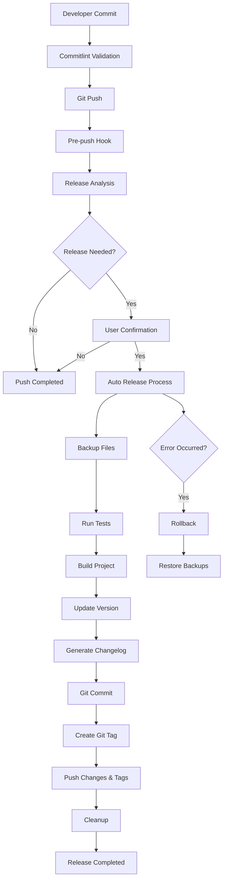

# 🚀 Automated Release Management

Sistema completo di gestione rilasci automatici basato su Conventional Commits e Semantic Versioning.

## 📋 Overview

Il sistema di release automation implementa un workflow end-to-end che:

- **Analizza automaticamente** i commit per determinare necessità release
- **Calcola versioni** secondo Semantic Versioning
- **Gestisce il processo completo** dalla validazione al deploy
- **Fornisce safety features** per rilasci sicuri

## 🔧 Componenti Sistema

### 1. Commitlint + Husky

- **File**: `commitlint.config.js`, `.husky/commit-msg`
- **Funzione**: Validazione formato conventional commits
- **Configurazione**: Type/scope enums, message length limits

### 2. Release Analyzer

- **File**: `scripts/release-analyzer.js`
- **Funzione**: Analisi commit per determinare necessità release
- **Output**: JSON con analisi dettagliata e tipo release

### 3. Version Calculator

- **File**: `scripts/version-calculator.js`
- **Funzione**: Calcolo nuove versioni secondo SemVer
- **Features**: Major/minor/patch, prerelease, build metadata

### 4. Auto Release

- **File**: `scripts/auto-release.js`
- **Funzione**: Processo release completo automatizzato
- **Features**: Backup, rollback, test, build, tag, push

### 5. Pre-push Hook

- **File**: `.husky/pre-push`
- **Funzione**: Trigger automatico release detection su push
- **Features**: Conferma interattiva, detection CI/CD

## 🎯 Workflow Completo



## 📝 Conventional Commits

### Formato Standard

```
<type>(<scope>): <description>

[optional body]

[optional footer(s)]
```

### Tipi Supportati

| Tipo              | Versioning | Descrizione        |
| ----------------- | ---------- | ------------------ |
| `feat`            | Minor      | Nuove funzionalità |
| `fix`             | Patch      | Bug fix            |
| `BREAKING CHANGE` | Major      | Breaking changes   |
| `docs`            | None       | Documentazione     |
| `style`           | None       | Formatting         |
| `refactor`        | None       | Code refactoring   |
| `test`            | None       | Test               |
| `chore`           | None       | Maintenance        |

### Scopes Configurati

- `api` - API endpoints
- `auth` - Authentication
- `core` - Core functionality
- `config` - Configuration
- `logger` - Logging system
- `test` - Testing
- `ci` - CI/CD
- `release` - Release management

### Esempi Pratici

```bash
# Minor release (0.1.0 → 0.2.0)
feat(auth): add JWT authentication system

# Patch release (0.1.0 → 0.1.1)
fix(api): resolve timeout in user endpoints

# Major release (0.1.0 → 1.0.0)
feat(api)!: redesign user endpoints

BREAKING CHANGE: User API endpoints now require authentication
```

## 🛠️ Comandi Release

### Analisi Release

```bash
# Analizza necessità release
npm run release:analyze

# Output JSON per integrazione
npm run release:analyze:json

# Salva analisi su file
npm run release:analyze:save
```

### Calcolo Versioni

```bash
# Calcolo automatico
npm run release:version

# Calcolo specifico (dry-run)
npm run release:version:minor
npm run release:version:patch
npm run release:version:major
npm run release:version:prerelease
```

### Release Automation

```bash
# Release automatico completo
npm run release:auto

# Test senza modifiche (SICURO)
npm run release:auto:dry-run

# Force release anche se non necessario
npm run release:auto:force
```

## 🔒 Safety Features

### Backup Automatico

Il sistema crea automaticamente backup di:

- `package.json`
- `CHANGELOG.md`

### Rollback Automatico

In caso di errore durante il release:

1. Ripristina automaticamente i file dal backup
2. Pulisce modifiche parziali
3. Riporta messaggio di errore dettagliato

### Dry-Run Mode

Modalità test che simula tutto il processo senza modifiche:

```bash
npm run release:auto:dry-run
```

### Conferma Interattiva

Il pre-push hook chiede conferma prima del release (eccetto CI/CD).

## 🤖 Integrazione CI/CD

### Detection Automatica

Il sistema rileva automaticamente ambienti CI/CD:

- `$CI` environment variable
- `$GITHUB_ACTIONS`
- `$GITLAB_CI`

### Comportamento CI/CD

- Skip conferma interattiva
- Modalità non interattiva
- Log dettagliati per debugging

### GitHub Actions Esempio

```yaml
name: Release
on:
  push:
    branches: [main]

jobs:
  release:
    runs-on: ubuntu-latest
    steps:
      - uses: actions/checkout@v3
      - uses: actions/setup-node@v3
      - run: npm ci
      - run: npm run release:auto
```

## 🔍 Debugging e Troubleshooting

### Log Dettagliati

Ogni step del processo produce log dettagliati:

```bash
🔍 Starting release analysis...
📦 Current version: 0.1.0
📍 No previous release tags found
📝 Found 14 commits since last release
📊 Analysis completed: ✅ Yes (minor)
🔢 Calculating new version for minor release...
📦 Version: 0.1.0 → 0.2.0
```

### Errori Comuni

#### "No release needed"

- Nessun commit `feat`/`fix` dall'ultimo release
- Usa `--force` per forzare release

#### "Failed to analyze commits"

- Verificare formato conventional commits
- Controllare disponibilità git history

#### "Tests failed"

- Fix test failure prima del release
- Usa `--skip-tests` solo in emergenza

### File di Output

Il sistema può generare file di analisi:

```bash
npm run release:analyze:save
# Crea: release-analysis.json
```

## 📊 Metriche e Monitoring

### Analisi Commit

Il sistema traccia:

- Numero commit per tipo
- Percentuale coverage dei conventional commits
- Frequenza release

### Release Statistics

Per ogni release viene tracciato:

- Tipo release (major/minor/patch)
- Numero commit inclusi
- Tempo processo
- Success/failure rate

## 🔮 Estensioni Future

### Possibili Miglioramenti

- [ ] Integrazione Slack/Teams notifications
- [ ] Release notes automatiche con AI
- [ ] Integration test automatici pre-release
- [ ] Deployment automatico post-release
- [ ] Metriche avanzate e dashboard
- [ ] Multi-branch release strategy

### Plugin Ecosystem

Il sistema è progettato per essere estensibile con:

- Custom analyzers
- Additional version calculators
- External notification systems
- Custom deployment hooks

---

🚀 **Sistema pronto per produzione** - Testato, sicuro e completamente automatizzato!
